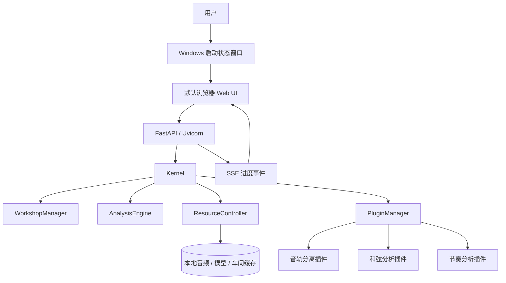

<div align="center">

# TABsucks

### 本地运行的智能音乐分离、和弦分析与辅助制谱平台

将一首歌拆解成可学习、可分析、可播放、可二次创作的音乐信息。

<p>
  <a href="https://github.com/GotoMiyuki/TABsucks/actions/workflows/codeql.yml">
    
  </a>
  <a href="https://github.com/GotoMiyuki/TABsucks">
    
  </a>
  <a href="https://github.com/GotoMiyuki/TABsucks">
    
  </a>
  <a href="https://github.com/GotoMiyuki/TABsucks">
    
  </a>
</p>

</div>

---

## 项目简介

TABsucks 是一个核心分析在本机执行、离线优先的智能音乐应用。它以音频为输入，通过音轨分离、和弦识别、节奏分析和可视化，将复杂的混合音乐转化为更容易学习和创作的结构化结果。通过 URL 导入音频以及源码首次准备部分依赖时仍需要网络。

软件采用 **本地 Web UI + Python 微内核 + 插件系统**。Windows 用户双击桌面程序后，启动状态窗口会显示实时日志，服务就绪后自动打开浏览器访问本地地址。

> 当前阶段分支：`end_main`<br>
> 文档状态日期：2026-07-18<br>
> 当前发行状态：CPU 基础包和模型包已生成；GPU 升级包待重新生成和安装验证，尚未作为最终发行资产发布。

## 你可以用它做什么

| 场景 | 典型流程 |
|---|---|
| 练习乐器 | 导入歌曲 → 分离目标音轨 → 查看和弦/节奏 → 降速与循环练习 |
| 辅助扒谱 | 分离人声、鼓、贝斯、钢琴、吉他和其他声部 → 对指定轨道进行分析 |
| 音乐制作 | 查看结构化和弦与节奏结果 → 导出 MIDI → 进入 DAW 二次编曲 |
| 音乐教学 | 使用波形、节拍、和弦和音轨混音状态辅助讲解 |

## 核心功能

### 四个 Tab，串起一条完整工作流

| Tab | 能力 |
|---|---|
| **Tab1 · 输入** | 创建/切换音乐车间，上传本地音频或通过 URL 获取音频 |
| **Tab2 · 分离** | 选择分离模型和 CPU/GPU 设备，生成六类音轨并查看进度 |
| **Tab3 · 分析** | 为不同音轨选择和弦、节奏、Bass 等分析插件 |
| **Tab4 · 播放与可视化** | 查看波形、和弦、节拍，控制播放、变速、循环、静音和独奏 |

### 工程能力

- 本地运行，用户音频默认不上传到远程服务；
- 支持 CPU 推理和 NVIDIA GPU 推理；
- Tab2 请求 GPU 分离时，如插件仅支持 CPU，会自动回退到 CPU；如本机 CUDA 不可用，则明确提示失败；
- 音乐车间状态自动保存，支持重启恢复；
- 业务插件可通过 `manifest.json` 发现和按需加载，示例等内置插件也可由代码显式注册；
- 长耗时分析通过后台任务执行，并通过 SSE 推送进度；
- Bass Root Detector 使用临时单声道输入，避免双声道数组造成异常内存申请；
- Windows 启动器提供实时日志、端口探测、浏览器自动打开和安全退出。

## 快速开始

### Windows 用户

Windows 发行包采用分层安装：

```text
1. 安装 CPU 基础包
2. NVIDIA GPU 用户安装 GPU/CUDA 升级包（可选）
3. 安装模型资源包
4. 双击 TABsucks.exe
5. 等待状态窗口提示服务就绪，浏览器会自动打开
```

安装完成后，程序默认位于：

```text
%LOCALAPPDATA%\Programs\TABsucks
```

用户数据、车间、缓存和日志默认位于：

```text
%LOCALAPPDATA%\TABsucks
├── cache
└── logs
```

### 源码开发者

项目推荐使用 64 位 Python 3.10 虚拟环境。

```powershell
git clone https://github.com/GotoMiyuki/TABsucks.git
cd TABsucks

python -m venv .venv
.\.venv\Scripts\Activate.ps1

# CPU 源码运行环境
python -m pip install -r requirements.txt

# 启动本地 Web 服务
python -m src.ui
```

服务默认监听：

```text
http://127.0.0.1:8000
```

如果 `8000` 端口被占用，可以指定其他端口：

```powershell
python -m src.ui --host 127.0.0.1 --port 8001
```

> 源码运行依赖 FFmpeg/FFprobe。当前入口会调用 `static-ffmpeg` 准备二进制文件；本机缓存不存在时可能从 GitHub 下载，因此首次启动需要可访问 GitHub 的网络环境。离线使用前应先完成该资源准备。

### NVIDIA GPU 开发环境

CPU 和 GPU 依赖环境应当二选一，不要在同一个虚拟环境中混装：

```powershell
python -m pip install -r requirements-gpu.txt -c constraints-windows.txt
```

当前已验证的 GPU 构建基线：

```text
Python 3.10.18
PyTorch 2.6.0+cu124
CUDA 12.4
ONNX Runtime GPU 1.23.2
```

GPU 推理仍需要用户安装兼容的 NVIDIA 显卡驱动。GPU 版本不保证所有插件都使用 GPU，插件自身只支持 CPU 时会自动回退。

## 发行结构

完整 AI 运行环境体积较大，且 GitHub Release 对单个资产有 2 GiB 限制，因此 Windows 发行版拆分为三个组件：

```text
CPU 基础包
├── TABsucks.exe 与基础运行文件
├── CPU 版 PyTorch / ONNX Runtime
├── FFmpeg / FFprobe
└── 基础功能

模型资源包
├── BS-RoFormer 模型
├── ChordMini 模型
└── 其他分析资源

GPU/CUDA 升级包
├── CUDA 版 PyTorch
├── ONNX Runtime GPU Provider
└── GPU 运行依赖
```

对应的构建文件：

```text
packaging/tabsucks.spec
packaging/tabsucks-base.iss
packaging/tabsucks-models.iss
packaging/tabsucks-gpu-addon.iss
scripts/build_split_release.ps1
scripts/verify_packaged_runtime.py
```

## 系统架构



核心模块职责：

- **Kernel：** 负责系统启动、车间生命周期和整体关闭；
- **WorkshopManager：** 管理音乐车间的创建、加载、切换、保存和删除；
- **AnalysisEngine：** 编排分离与分析任务；
- **ResourceController：** 管理模型、音频缓冲和 CPU/GPU 资源；
- **PluginManager：** 扫描插件清单并完成注册、加载和调用；
- **FastAPI/Uvicorn：** 提供 HTTP API、文件服务和 SSE 事件流；
- **Windows Launcher：** 管理本地服务、日志、端口和浏览器启动。

## 插件系统

可发布业务插件通过标准清单描述自己的入口、阶段、输入、输出和资源需求；示例插件等内置能力也可以由内核显式注册。

| 类型 | 当前插件 | 主要输出 |
|---|---|---|
| 音轨分离 | BS-RoFormer 6-Stem Separator | 人声、鼓、贝斯、钢琴、吉他、其他 |
| 和弦分析 | BTC-SL / ChordMini | 和弦标签与时间轴 |
| 和弦分析 | ISMIR 2019 | 和弦识别结果 |
| 节奏分析 | Foundation Rhythm Analyzer | BPM、拍号、节拍与复杂度 |

插件清单示例：

```text
src/plugins/separation/model_1/manifest.json
src/plugins/chord/manifest.json
src/plugins/rhythm/manifest.json
```

## 项目目录

```text
src/
├── audio/       音频加载、下载与播放
├── kernel/      微内核、车间、缓存和任务编排
├── plugins/     分离、和弦和节奏插件
├── ui/          FastAPI、桌面启动器和 Web UI
├── visualizer/  波形、节拍和和弦可视化
└── utils/       通用工具

tests/           Python 与 JavaScript 自动化测试
packaging/       PyInstaller、Inno Setup 和 FFmpeg 资源
scripts/         构建、验证和开发工具
docs/            架构、开发、发行和项目报告
models/          本地模型资源，不提交到 Git 历史
```

## 软件工程实践

TABsucks 将课程要求中的软件工程实践落到仓库和发布流程中：

| 工作方向 | 项目实践 |
|---|---|
| 软件过程 | 分阶段规划、功能分支、Pull Request、阶段开发日志 |
| 需求工程 | 功能需求 FR、非功能需求 NFR、需求追踪矩阵 |
| 系统建模 | 用例、模块职责、工作流和数据流建模 |
| 架构设计 | 微内核、插件、资源控制器、分析编排器分层 |
| 软件工程化 | requirements 分层、PyInstaller、PowerShell、Inno Setup |
| 测试与质量保证 | pytest、JavaScript 测试、Ruff、mypy、CodeQL、运行时验证 |
| 配置与运维 | Git 基线、发行校验、日志、缓存、回滚和故障分级 |

当前 GitHub Actions 已配置：

- `CodeQL`：对 Python 代码执行静态安全分析；
- `AI Code Review`：对 Pull Request 执行自动化评审。

普通 lint/test/build CI、代码签名和自动 Release 仍属于后续完善项，README 不将它们描述为已经完成。

## 文档导航

### 项目开发文档

- [架构设计](docs/架构设计.md)
- [HTTP API](docs/HTTP_API.md)
- [插件编排设计](docs/plugin_orchestration.md)
- [开发指导](docs/development_guide.md)
- [Windows 发行指南](docs/windows_release.md)
- [阶段开发日志](docs/development_logs/end-main.md)

### 课程提交材料

- [需求分析报告](docs/homework-1/需求构思与建模.md)
- [软件配置与运维文档](docs/submissions/软件配置与运维文档.md)
- [其他课程材料目录](docs/homework-1/)

## 测试与质量检查

安装开发依赖：

```powershell
python -m pip install -r requirements-dev.txt
```

运行 Python 测试：

```powershell
python -m pytest
```

运行静态检查：

```powershell
ruff check .
python -m black --check .
python -m mypy src
```

按当前 Python 环境构建 Windows 便携发行版：

```powershell
.\scripts\build_windows.ps1 -SkipInstaller
```

构建拆分发行包：

```powershell
.\scripts\build_split_release.ps1 `
  -CpuPython .\.build\cpu-venv\Scripts\python.exe
```

## 已知限制

- 当前主要验证平台为 Windows x64；
- GPU 运行依赖兼容的 NVIDIA 驱动；
- 模型和 GPU 运行环境体积较大；
- 部分插件只支持 CPU；
- 超长音频可能占用较多内存和磁盘；
- FFmpeg、模型权重和第三方插件需要单独进行许可证核查；
- 当前 EXE 尚未进行代码签名，Windows SmartScreen 可能显示未知发布者；
- 最终 GPU 升级包需要重新生成、安装验证后才能作为正式 Release 资产。

## 参与项目

欢迎通过 Issue 或 Pull Request 提交问题、改进建议和插件想法。提交代码前请阅读：

- [开发指导](docs/development_guide.md)
- [软件配置与运维文档](docs/submissions/软件配置与运维文档.md)

建议提交信息使用以下类型：

```text
feat    新功能
fix     缺陷修复
test    测试
docs    文档
refactor 重构
build   构建与发行
ci      持续集成
```

## 许可证

项目源码采用 [MIT License](LICENSE)。模型权重、第三方插件和外部研究代码可能具有独立许可证，使用或重新分发前请以对应目录中的许可证文件为准。

---

<div align="center">

TABsucks · 拆解音乐，理解音乐，重新创作

</div>
