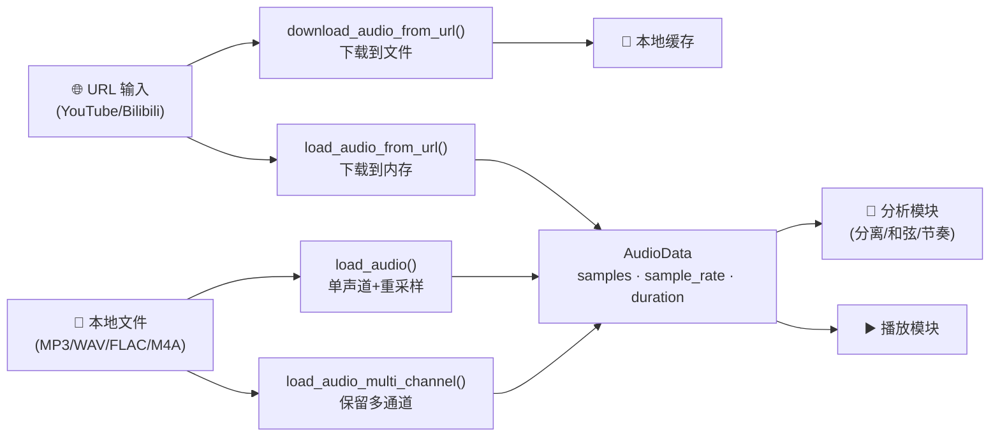
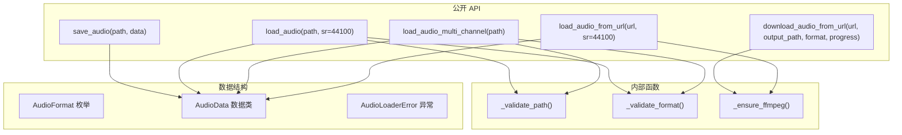
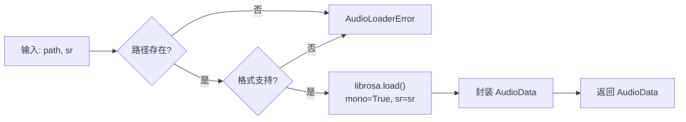

# 音频加载模块开发日志

> 本文档记录 P0 音频输入模块（FR-01）的设计决策、实现细节和使用说明，供团队成员查阅。

---

## 一、模块概述

音频加载模块位于 `src/audio/loader.py`，负责所有音频输入相关功能：

- 支持本地文件加载（MP3/WAV/FLAC/M4A）
- 支持 YouTube/Bilibili URL 直接加载
- 提供统一的 `AudioData` 数据结构

### 核心依赖

| 依赖 | 用途 |
|------|------|
| `librosa` | 本地音频文件解码、重采样 |
| `soundfile` | 音频文件保存 |
| `yt-dlp` | YouTube/Bilibili 视频音频提取 |
| `static-ffmpeg` | ffmpeg 自动下载（yt-dlp 依赖） |

---

## 二、架构设计

### 2.1 音频数据流图



### 2.2 函数分类



---

## 三、核心数据结构

### 3.1 AudioData

```python
@dataclass(frozen=True)
class AudioData:
    samples: np.ndarray      # 形状 (n_samples,) 或 (channels, n_samples)
    sample_rate: int         # 采样率 Hz
    duration: float          # 时长 秒

    @property
    def channels(self) -> int:      # 通道数
    @property
    def n_samples(self) -> int:    # 样本数量
```

**设计说明**：
- `frozen=True` 保证不可变，线程安全
- `samples` 形状根据加载方式不同：
  - `load_audio` → `(n_samples,)` 单声道
  - `load_audio_multi_channel` → `(channels, n_samples)` 多通道

### 3.2 AudioFormat

```python
class AudioFormat(Enum):
    MP3 = "mp3"
    WAV = "wav"
    FLAC = "flac"
    M4A = "m4a"
```

---

## 四、函数详解

### 4.1 本地文件加载

#### `load_audio(path, sr=44100)`



- **输入**：音频文件路径 + 目标采样率
- **输出**：`AudioData(samples=(n_samples,), sample_rate, duration)`
- **特点**：转单声道 + 可选重采样，适合分析任务

#### `load_audio_multi_channel(path)`

- **输入**：音频文件路径
- **输出**：`AudioData(samples=(channels, n_samples), sample_rate=原始, duration)`
- **特点**：保留原始声道和采样率，适合多轨播放

#### `save_audio(path, data)`

- **输入**：输出路径 + `AudioData`
- **输出**：无（写入文件）
- **格式**：由路径扩展名决定（.wav/.mp3/.flac/.m4a）

### 4.2 URL 下载与加载

#### `download_audio_from_url(url, output_path, format, progress)`


- **ffmpeg 依赖处理**：通过 `static-ffmpeg` 自动检测/下载
- **output_path**：默认在当前目录生成 `temp_audio_{pid}.{format}`

#### `load_audio_from_url(url, sr=44100)`

- **特点**：下载到临时目录 → 加载到内存 → 自动清理
- **无需保存本地文件**，适合一次性分析

---

## 五、ffmpeg 依赖方案

### 5.1 方案选择

| 方案 | 包体积 | 用户操作 | 复杂度 |
|------|--------|---------|--------|
| static-ffmpeg | +80MB | 零 | 极简 |
| 用户自行安装 | 0 | 需手动 | 简单 |
| Tauri 打包 | +80MB | 零 | 复杂 |

**选择理由**：`static-ffmpeg` 在首次调用时自动下载 ffmpeg 到 `~/.cache/static-ffmpeg/`，用户零配置。

### 5.2 实现

```python
def _ensure_ffmpeg() -> None:
    """确保 ffmpeg 可用，不存在则自动下载。"""
    import static_ffmpeg
    static_ffmpeg.add_paths()  # 自动检测/下载/加入 PATH
```

调用位置：`download_audio_from_url` 和 `load_audio_from_url` 函数开头。

---

## 六、使用示例

### 6.1 本地文件加载

```python
from src.audio.loader import load_audio, save_audio, AudioData

# 加载音频（重采样为 44100Hz 单声道）
audio = load_audio("song.mp3", sr=44100)
print(f"时长: {audio.duration}s, 采样率: {audio.sample_rate}Hz")

# 保存为不同格式
save_audio("song.wav", audio)
```

### 6.2 URL 加载

```python
from src.audio.loader import download_audio_from_url, load_audio_from_url

# 从 B 站下载（保存到文件）
path = download_audio_from_url(
    "https://www.bilibili.com/video/BV1Ye4y1f7kA",
    output_path="output.mp3"
)

# 从 YouTube 直接加载到内存（无需保存文件）
audio = load_audio_from_url(
    "https://www.youtube.com/watch?v=mt56HEafeWU",
    sr=22050  # 可指定采样率
)
print(f"时长: {audio.duration}s")
```

### 6.3 多通道加载

```python
from src.audio.loader import load_audio_multi_channel

# 保留原始多通道（适合播放或空间音频处理）
audio = load_audio_multi_channel("stereo.wav")
print(f"声道数: {audio.channels}")
```

---

## 七、测试

### 7.1 测试文件

- `tests/unit/test_audio_loader.py` - 单元测试
- `tests/conftest.py` - pytest fixtures

### 7.2 运行测试

```bash
# 本地测试（19 个）
conda run -n tabsucks pytest tests/unit/test_audio_loader.py -v -m "not network"

# 网络测试（B站 + YouTube，需要网络连接）
conda run -n tabsucks pytest tests/unit/test_audio_loader.py -v -m network
```

### 7.3 测试结果

| 测试集 | 结果 | 数量 |
|--------|------|------|
| 本地测试 | ✅ 全部通过 | 19/19 |
| B站下载/加载 | ✅ 全部通过 | 2/2 |
| YouTube 下载/加载 | ✅ 全部通过（VPN） | 2/2 |

---

## 八、设计决策记录

### 8.1 为什么 `load_audio` 和 `load_audio_multi_channel` 分开？

**决策**：两者是互补关系，适用于不同场景。

| 函数 | 输出格式 | 采样率 | 用途 |
|------|---------|--------|------|
| `load_audio` | 单声道 `(n_samples,)` | 可转换 | 分离器、和弦/节奏分析 |
| `load_audio_multi_channel` | 多通道 `(ch, n_samples)` | 原始 | 多轨播放、空间音频处理 |

### 8.2 为什么 `AudioData` 用 `frozen=True`？

**决策**：不可变数据结构，保证线程安全和引用透明。

注意：`frozen=True` 只阻止 field 重新赋值（`data.samples = new_array`），无法阻止 numpy 数组的 in-place 修改。但音频分析场景下一般不会修改原始数据，影响可忽略。

### 8.3 为什么用 `static-ffmpeg` 而不是让用户手动安装？

**决策**：降低使用门槛，实现"零配置"体验。

`static-ffmpeg.add_paths()` 会自动检测系统是否有 ffmpeg，无则从 GitHub 下载到 `~/.cache/static-ffmpeg/`。

### 8.4 音频保存的必要性？

**决策**：保留，原因：
1. 内存不足时缓存到本地（符合 ResourceController 设计）
2. 音乐车间（FR-07）切换时需要持久化音频状态
3. 架构文档明确要求"分离出的高质量 .wav 音轨块"

---

## 九、后续待办

| 优先级 | 内容 | 说明 |
|--------|------|------|
| 非阻塞 | 优化 `load_audio_from_url` | 可合并两个 YoutubeDL 实例为一次调用，但当前设计（fail-fast）已合理 |
| P1 | 集成到 AnalysisEngine | 与分离器、和弦分析模块对接 |
| P1 | 音乐车间持久化 | 结合 FR-07 实现车间切换时保存/恢复音频 |

---

## 十、文件清单

```
src/audio/loader.py      # 核心实现
tests/unit/test_audio_loader.py  # 单元测试
tests/conftest.py        # pytest fixtures
requirements.txt         # 依赖声明
pyproject.toml          # pytest 配置（含 network mark）
```