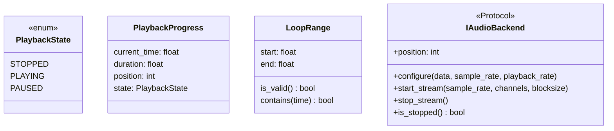
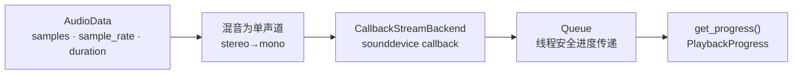
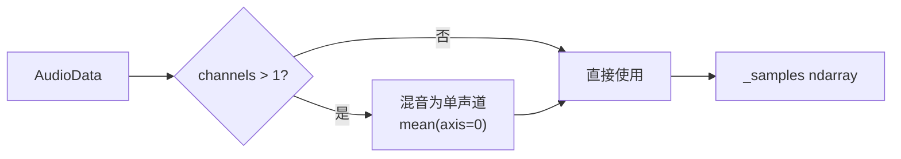

# 开发日志：音频播放控制模块（FR-05）

**日期：** 2026-05-30
**涉及模块：** `src/audio/player.py`
**依赖项：** `sounddevice>=0.4.0`

---

## 一、模块概述

音频播放控制模块位于 `src/audio/player.py`，负责 FR-05 播放控制的所有功能：

- 播放 / 暂停 / 停止 / 跳转
- 调速（0.5x ~ 2.0x）
- 循环 A-B 段
- 实时进度轮询

---

## 二、架构设计

### 2.1 核心数据结构



### 2.2 音频数据流



### 2.3 非阻塞播放原理

```
主线程                          播放线程
   │                               │
   │── play() ──────────────────▶  │── OutputStream.start()
   │                               │
   │── get_progress()              │── callback 写入 Queue
   │◀── PlaybackProgress ──────────┤
   │                               │
```

`CallbackStreamBackend` 使用 `sounddevice.OutputStream(callback=...)`，播放线程通过 `queue.Queue` 将进度数据传递给主线程，主线程以轮询方式获取（`get_progress()` / `get_progressBlocking()`），完全避免跨线程 UI 回调。

---

## 三、核心数据结构详解

### 3.1 PlaybackState（枚举）

```python
class PlaybackState(Enum):
    STOPPED = 1
    PLAYING = 2
    PAUSED = 3
```

### 3.2 PlaybackProgress

```python
@dataclass(frozen=True)
class PlaybackProgress:
    current_time: float   # 当前播放时间（秒）
    duration: float       # 总时长（秒）
    position: int         # 当前采样点位置
    state: PlaybackState # 当前状态
```

### 3.3 LoopRange

```python
@dataclass(frozen=True)
class LoopRange:
    start: float  # 循环起点（秒），须 > 0
    end: float    # 循环终点（秒），须 > start

    def is_valid(self) -> bool: ...
    def contains(self, time: float) -> bool: ...
```

**验证规则**：`start > 0` 且 `end > start`。

### 3.4 IAudioBackend（Protocol）

```python
class IAudioBackend(Protocol):
    def configure(self, data: np.ndarray, sample_rate: int, playback_rate: float) -> None: ...
    def start_stream(self, sample_rate: int, channels: int, blocksize: int) -> None: ...
    def stop_stream(self) -> None: ...
    def is_stopped(self) -> bool: ...
    @property
    def position(self) -> int: ...
    def advance(self, frames: int) -> None: ...
```

设计目的：后端抽象，测试时注入 `MockBackend`，无需真实 sounddevice。

---

## 四、函数详解

### 4.1 AudioPlayer.load()



- 立体声自动混音为单声道
- Duck-typed 接口，接收任意具有 `samples / sample_rate / duration` 的对象
- 重置 position 为 0，状态置为 STOPPED

### 4.2 AudioPlayer.play()

- **前置条件**：必须先调用 `load()`
- **幂等性**：已在播放时再次调用直接返回，不创建重复线程
- **后端启动**：调用 `CallbackStreamBackend.start_stream()`

### 4.3 AudioPlayer.seek(time)

- 负数 → 裁剪到 0.0
- 超出 duration → 裁剪到 duration
- 直接修改 `_position`（采样点位置）

### 4.4 AudioPlayer.set_rate(rate)

- 范围校验：[0.5, 2.0]，超出抛 `ValueError`
- 边界值 0.5、1.0、2.0 均接受

### 4.5 AudioPlayer.set_loop(start, end)

- 验证：`start > 0` 且 `end > start`，否则抛 `ValueError`
- 传入 `None` 清除循环

### 4.6 AudioPlayer.set_volume(volume)

- 自动 clip 到 [0.0, 1.0]

### 4.7 AudioPlayer.get_progress() / get_progressBlocking()

- `get_progress()`：非阻塞，队列空返回 `None`
- `get_progressBlocking(timeout)`：阻塞等待，超时返回 `None`
- 返回 `PlaybackProgress(current_time, duration, position, state)`

---

## 五、单元测试

### 5.1 测试文件

| 文件                          | 测试数 |
| --------------------------- | --- |
| `tests/unit/test_player.py` | 32  |
|                             |     |

### 5.2 测试覆盖场景

| 场景          | 验证点                                            |
| ----------- | ---------------------------------------------- |
| 播放前置检查      | `play()` 未 `load()` 时抛 `RuntimeError`          |
| 播放幂等性       | 连续两次 `play()` 不创建重复线程                          |
| seek 边界     | 负数裁剪到 0，超出裁剪到 duration                         |
| rate 范围     | 0.49 / 0.5 / 1.0 / 2.0 / 2.1 边界验证              |
| loop 有效性    | start=0 / end≤start / 负数 start 均抛 `ValueError` |
| volume clip | 1.5 → 1.0，-0.5 → 0.0                           |
| 进度队列        | 初始无数据，超时不返回                                    |
| 立体声混音       | stereo→mono 等于单声道处理                            |
| JSON 序列化    | `to_dict()` 全部 JSON 可序列化                       |

---

## 六、设计决策记录

### 6.1 为什么用 Queue 而非回调通知前端？

**决策**：避免跨线程 UI 调用。

回调模式要求后端直接调用前端函数，在多线程环境下极易导致竞态条件。Queue 模式将数据放入队列，主线程以轮询方式获取，前端可在自己的事件循环中安全处理。

### 6.2 为什么 `IAudioBackend` 用 Protocol 而非 ABC？

**决策**：Protocol 更轻量，且支持结构子类型（Duck Typing）。

`MockBackend` 无需继承任何类，只需实现相同方法签名即可注入，测试代码最简化。

### 6.3 为什么 `CallbackStreamBackend` 在模块级别创建 Stream？

**决策**：sounddevice 的 `OutputStream` 必须在主线程创建，但在回调线程运行。模块级管理可通过 `stop_stream()` 精确控制生命周期。

### 6.4 为什么不直接用 `simpleaudio` 而用 `sounddevice`？

**决策**：`sounddevice` 的 callback 模式更适合非阻塞播放和精确进度控制。`simpleaudio` 的 `play()` 是同步阻塞，不方便实现 `get_progress()` 轮询。

---

## 七、与 FR-06 的关系

```
AudioPlayer ──▶ load(AudioData)
                    │
                    ▼
               export_visualization_json(AudioData)
                    │
                    ▼
               {waveform, beats, chords, metadata}
```

- `AudioPlayer` 和 `export_visualization_json` 均接收 `AudioData`
- 两者通过 Duck-typed 接口解耦，互不依赖
- 共同的下一阶段目标：在 `MusicWorkshop` 层建立关联，实现播放时实时更新可视化

---

## 八、文件清单

```
src/audio/player.py              # 核心实现
tests/unit/test_player.py       # 单元测试（32 tests）
requirements.txt               # sounddevice>=0.4.0
```
