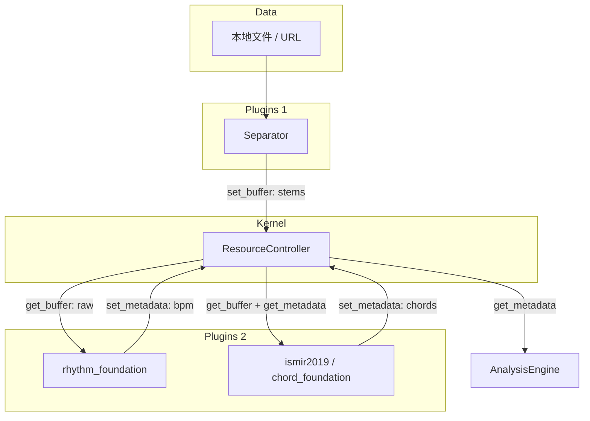

# ResourceController 模块初级开发日志

> 本文档记录 ResourceController（Kernel 核心组件）的设计决策、实现细节和使用说明，供团队成员查阅。

---

## 一、模块概述

ResourceController 位于 `src/kernel/core/resource_controller.py`，是 TABsucks 微内核架构中的**共享状态总线**。所有分析插件通过它读写音频 buffer、元数据和模型资源，实现插件间的解耦通信。

作为管理整个 TABsucks 系统的内存、元数据、模型生命周期的核心组件，ResourceController 在这次更新中并没有开发完全，而是仅仅完成了一个能运行的基地骨架，在我将几个核心插件和 AnalysisEngine 完善后会补全更加细致的安全加固和管理、调度的策略。

### 设计定位

```
┌─────────────┐     set_buffer / set_metadata      ┌──────────────────┐
│ Separator   │ ─────────────────────────────────▶ │                  │
└─────────────┘                                     │   Resource       │
┌─────────────┐     get_buffer("piano")             │   Controller     │
│ Chord       │ ◀────────────────────────────────  │                  │
│ Plugin      │     request_model("stem_cf")        │  ┌─ buffers     │
└─────────────┘     set_metadata("chord_raw_piano") │  ├─ metadata    │
┌─────────────┘                                     │  └─ models      │
│ Rhythm      │     get_buffer("raw")               │                  │
│ Plugin      │ ◀────────────────────────────────  │                  │
└─────────────┘     set_metadata("global_bpm")      │                  │
┌─────────────┐                                     │                  │
│ Analysis    │     get_metadata("chord_raw_piano") │                  │
│ Engine      │ ◀────────────────────────────────  │                  │
└─────────────┘                                     └──────────────────┘
```

### 核心依赖

| 依赖 | 用途 |
|------|------|
| `numpy` | buffer 数据类型（音频数组、onset 包络） |
| `torch` | 模型加载/推理设备检测（可选，graceful fallback 到 CPU） |

---

## 二、API 说明

### 2.1 Buffer 操作

```python
rc.set_buffer("raw", audio_array)      # 写入音频 buffer
raw = rc.get_buffer("raw")             # 读取，不存在时抛 ResourceControllerError
```

**命名约定**（按插件使用情况）：

| Buffer Key | 写入方 | 读取方 | 数据类型 |
|-----------|--------|--------|---------|
| `"raw"` | Kernel（加载后） | rhythm_foundation | `np.ndarray` |
| `"bass"` | Separator | chord_foundation, bass_root | `np.ndarray` |
| `"piano"` | Separator | chord_foundation | `np.ndarray` |
| `"guitar"` | Separator | chord_foundation | `np.ndarray` |
| `"other"` | Separator | chord_foundation | `np.ndarray` |
| `"global_onset_env"` | rhythm_foundation | Phase C（计划） | `np.ndarray` |

### 2.2 Metadata 操作

```python
rc.set_metadata("sample_rate", 22050)  # 写入
sr = rc.get_metadata("sample_rate")    # 读取，不存在时返回 None（不抛异常）
```

**命名约定**：

| Metadata Key | 写入方 | 读取方 | 数据类型 |
|-------------|--------|--------|---------|
| `"sample_rate"` | Kernel（初始化时） | rhythm_foundation, ismir2019, bass_root | `int` |
| `"global_bpm"` | rhythm_foundation | AnalysisEngine | `float` |
| `"time_signature"` | rhythm_foundation | AnalysisEngine | `str` |
| `"needs_deep_rhythm_analysis"` | rhythm_foundation | AnalysisEngine | `bool` |
| `"beat_map"` | rhythm_foundation | chord_foundation | `List[float]` |
| `"chord_raw_{stem}"` | ismir2019 | AnalysisEngine | `List[Dict]` |
| `"bass_root"` | bass_root | AnalysisEngine | `str` |

### 2.3 模型生命周期

```python
# 请求加载模型（缓存命中则直接返回）
model = rc.request_model("stem_chordformer", loader_fn)

# 卸载指定模型，释放显存
rc.release_model("stem_chordformer")

# 返回当前推理设备（torch.device 或 "cpu"）
device = rc.get_current_device()
```

**`request_model` 的 loader 回调**：

```python
def _load_model(model_name: str):
    """RC 调用此函数加载模型，返回模型对象。"""
    model = StemChordFormer(...)
    model.load_state_dict(torch.load(...))
    model.eval()
    return model

model = rc.request_model("stem_chordformer", _load_model)
```

**设计说明**：
- `request_model` 内部做缓存，相同 name 只调用一次 loader
- 当前版本不做 VRAM 锁和容量检查（同时间只有一个重型模型在显存）
- 等后续有显存压力时，在 RC 内部加锁即可，插件代码无需改动

### 2.4 重置

```python
rc.clear()              # 清空所有 buffer、metadata、model 缓存
rc.release_all_models() # 仅卸载所有模型
```

---

## 三、架构设计

### 3.1 在系统中的位置
这里的 AnalysisEngine 实际上是在 Kernel 层、两个 Plugins 层也是一体的，为了清晰美观而如下图


### 3.2 解耦原理

插件之间**互不 import、互不调用**，仅通过 RC 的 key-value 存储通信：

- rhythm 插件写 `set_metadata("global_bpm", 120)` → chord 插件读 `get_metadata("global_bpm")`
- Separator 写 `set_buffer("piano", audio)` → chord 插件读 `get_buffer("piano")`

这种设计的好处：
1. **依赖倒置**：插件不需要知道彼此的存在
2. **执行顺序灵活**：只要保证写入方先于读取方执行即可
3. **可独立测试**：mock RC 就能测试单个插件
4. **预防了GPU竞争**：request_model 的存在意义是：当 chord 插件要加载 StemChordFormer 到显存时，RC 知道分离模型是否还在显存里，可以先卸载再加载。如果各插件自己管 torch.cuda，就会互相踩踏。

---

## 四、实现细节

### 4.1 内部状态

```python
class ResourceController:
    def __init__(self) -> None:
        self._buffers: dict[str, np.ndarray] = {}
        self._metadata: dict[str, Any] = {}
        self._models: dict[str, Any] = {}
        self._device: Any = None
```

三个字典分别管理音频数据、轻量元数据和重型模型对象。`_device` 做了延迟检测，首次调用 `get_current_device()` 时才检查 CUDA。

### 4.2 与 `__init__.py` 的延迟导入

`src/kernel/core/__init__.py` 使用 `__getattr__` 延迟导入，避免 `workspace.py` 的重量级依赖（soundfile、librosa 等）在不需要时被加载：

```python
def __getattr__(name: str):
    if name == "ResourceController":
        from src.kernel.core.resource_controller import ResourceController
        return ResourceController
    # ... 其他模块同理
```

### 4.3 修复的 import 路径

本次顺带修复了多处断裂的 import 路径：

| 文件 | 原路径（断） | 修正后 |
|------|------------|--------|
| `ismir2019.py` | `from src.plugins.base import BasePlugin` | `from src.plugins import BasePlugin` |
| `ismir2019.py` | `from src.core.resource_controller import ...` | `from src.kernel.core.resource_controller import ...` |
| `workspace.py` | `from src.separation.separator import ...` | `from src.plugins.separation.separator import ...` |
| `separation/__init__.py` | `from src.separation.separator import ...` | `from src.plugins.separation.separator import ...` |

另外在 `src/plugins/__init__.py` 中添加了 `BasePlugin = Plugin` 别名，兼容三个插件文件中 `from src.plugins import BasePlugin` 的写法。

---

## 五、使用示例

### 5.1 Kernel 初始化

```python
from src.kernel.core.resource_controller import ResourceController
from src.audio.loader import load_audio

rc = ResourceController()

# 加载原始音频并放入 buffer
audio = load_audio("song.mp3", sr=22050)
rc.set_buffer("raw", audio.samples)
rc.set_metadata("sample_rate", audio.sample_rate)
```

### 5.2 插件执行

```python
from src.plugins.rhythm.rhythm_foundation import FoundationRhythmPlugin

rhythm = FoundationRhythmPlugin()
result = rhythm.execute(rc)

print(rc.get_metadata("global_bpm"))      # → 120.0
print(rc.get_metadata("time_signature"))   # → "4/4"
print(result["data"]["complexity_score"])  # → 0.35
```

### 5.3 分析引擎读取插件结果

```python
piano_chords = rc.get_metadata("chord_raw_piano")
global_bpm = rc.get_metadata("global_bpm")
onset_env = rc.get_buffer("global_onset_env")
```

---

## 六、测试

### 6.1 测试文件

- `tests/unit/test_resource_controller.py` — 13 个单元测试

### 6.2 运行测试

```bash
py -m pytest tests/unit/test_resource_controller.py -v
```

### 6.3 测试覆盖

| 测试类 | 数量 | 覆盖内容 |
|--------|------|---------|
| `TestBuffer` | 3 | set/get、KeyError、覆盖写 |
| `TestMetadata` | 3 | set/get、None 返回、多类型支持 |
| `TestModel` | 5 | loader 调用、缓存命中、release、release_all、device 检测 |
| `TestClear` | 1 | clear 重置所有状态 |
| **合计** | **13** | **全部通过** |

---

## 七、设计决策记录

### 7.1 为什么 `get_metadata` 不存在时返回 None，而 `get_buffer` 抛异常？

**决策**：metadata 是轻量查询，None 表示"没有这个信息"是合理的（插件用 `or 默认值` 处理）。buffer 是硬依赖，缺了就必须报错，否则后续 numpy 运算会产生更难排查的错误。

```python
# metadata：插件侧的惯用写法
sample_rate = rc.get_metadata("sample_rate") or 22050

# buffer：缺了就该 fail-fast
raw_audio = rc.get_buffer("raw")  # 不存在直接抛异常
```

### 7.2 为什么 `request_model` 用 loader 回调而不是直接传模型路径？

**决策**：不同模型的加载方式差异很大（PyTorch、ONNX、subprocess）。loader 回调让 RC 不需要知道模型的具体类型，插件自行定义加载逻辑，RC 只负责缓存和生命周期管理。

### 7.3 为什么不做 VRAM 锁？

**决策**：当前项目阶段只有两个可能用 GPU 的插件（chord_foundation 用 StemChordFormer、separator 用 BS-RoFormer），且它们不会同时运行。先用最简实现跑通数据流，等有并发需求时再在 `request_model` 内部加锁。

### 7.4 为什么 `__init__.py` 用 `__getattr__` 延迟导入？

**决策**：`workspace.py` 导入了 `soundfile`、`numpy` 等重量级依赖。如果在 `__init__.py` 中 eagerly import，任何代码 `from src.kernel.core import ResourceController` 都会触发这些依赖的加载。延迟导入让 ResourceController 可以独立使用，不依赖音频处理库。

---

## 八、后续待办

| 优先级 | 内容 | 说明 |
|--------|------|------|
| P0 | 接通 ChordAnalyzer | `src/analysis/chord.py` 的 `analyze()` 应调用 ismir2019 plugin，通过 RC 获取结果 |
| P0 | 接通 RhythmAnalyzer | `src/analysis/rhythm.py` 的 `analyze()` 应消费 RC 中的 BPM/拍号数据 |
| P0 | RC 添加线程锁 | 为 `_buffers`、`_models` 等内部字典增加 `threading.RLock`，所有读/写方法（`get_buffer`、`set_buffer`、`request_model`、`release_model`）均需加锁，防止多线程下数据损坏。 |
| P0 | 实现引用计数模型管理 | 在 `request_model` 中增加引用计数，每次调用 +1；`release_model` 减 1，计数归零时才真正卸载模型。避免插件异常退出导致模型残留显存。 |
| P1 | VRAM 锁 | 当有多模型并发需求时，在 `request_model` 中加入显存锁 |
| P1 | 补充现有测试 | test_workspace.py / test_separator.py 的 import 路径需要同步修复 |
| P1 | 大 buffer 自动落盘 | 当单个 buffer 大小超过阈值（如 200MB）或总内存占用超过设定上限时，将最久未使用的 buffer 写入磁盘临时文件，需要时再按需加载回内存。降低内存峰值。 |
| P1 | 提供 `try_get_buffer` 等安全接口 | 增加 `try_get_buffer(name) -> Optional[np.ndarray]`，不抛异常；以及 `buffer_exists(name) -> bool`，便于插件优雅处理缺失资源。 |
| P1 | 实现显存预留与 LRU 淘汰 | 在 `request_model` 中集成简单 LRU 策略：加载新模型前预估显存需求，若剩余不足则卸载最近最少使用的非正在使用的模型。配合 VRAM 锁实现安全换入换出。 |
| P2 | 添加资源统计与健康检查 | 实现 `get_stats()` 返回 `{"buffer_count": int, "buffer_bytes": int, "model_count": int, "active_models": list}`，便于调试面板和日志监控资源泄漏。 |
| P2 | 引入 BufferPool 内存池 | 为频繁申请/释放的小型 buffer（如分帧后的音频块）预先分配固定大小的内存池，减少 GC 压力和内存碎片。可放在 `src/resource/pool.py` 中。 |
---

## 九、文件清单

```
src/kernel/__init__.py                    # 新建：使 src.kernel.core 成为合法包路径
src/kernel/core/__init__.py               # 修改：延迟导入 + ResourceController re-export
src/kernel/core/resource_controller.py    # 核心实现（119 行）
src/plugins/__init__.py                   # 修改：添加 BasePlugin 别名
src/plugins/chord/ismir2019.py            # 修改：修复 import 路径
src/plugins/separation/__init__.py        # 修改：修复 import 路径
src/kernel/core/workspace.py              # 修改：修复 separator import 路径
tests/unit/test_resource_controller.py    # 新建：13 个单元测试
```
