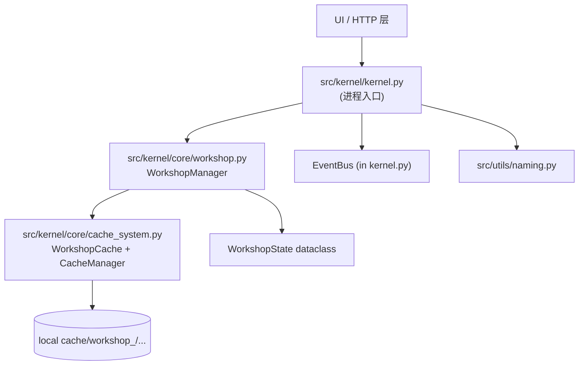
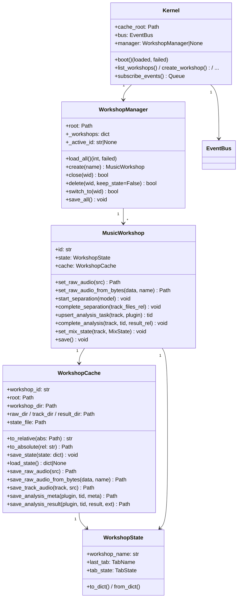

# 音乐车间 + 文件系统开发日志（FR-07 / FR-08 基础）

> 本文档记录 P1 阶段"音乐车间（Music Workshop）+ 文件系统缓存"的设计决策、
> 实现细节与使用说明，对应新增的三个文件：
>
> * [src/kernel/core/cache_system.py](../../src/kernel/core/cache_system.py)
> * [src/kernel/core/workshop.py](../../src/kernel/core/workshop.py)
> * [src/kernel/kernel.py](../../src/kernel/kernel.py)
>
> 以及更名/扩展的工具：
>
> * [src/utils/naming.py](../../src/utils/naming.py)（车间命名工具）
> * [src/kernel/core/workspace.py](../../src/kernel/core/workspace.py)（标 deprecated）

依据 `docs/meetings/2026-6-16-meeting.md`：

* §1 文件系统目录结构（cache/workshop_<id>/…）
* §4 音乐车间是"跨层级胶水"
* 附录 A 资产指纹暂缓，列入待办

---

## 一、模块概述

音乐车间（Music Workshop）将一段音频"从 URL/本地下载 → 加载 → 6 轨分离 → 节奏分析 → 和弦分析 → 6 轨混音"的完整工作流抽象为：

* **运行时**：单个 `MusicWorkshop` 实例 = 一间车间的内存表示（持有 WorkshopState）。
* **持久化**：`WorkshopState` dataclass ↔ `state.json` 双向转换，原子写入。
* **文件系统**：`WorkshopCache` 负责一间车间的目录树 + 文件级 IO。
* **多车间**：`WorkshopManager` 进程级多车间集合，加载时坏车间跳过（Obsidian 风）。
* **顶层**：`Kernel` 进程入口，持有 `EventBus` + `WorkshopManager`，未来挂 HTTP / SSE。

### 1.1 核心依赖

| 依赖 | 用途 |
|------|------|
| Python 3.11+ | `from __future__ import annotations` + `dataclass(slots=True)` 等 |
| `pathlib` | 所有路径处理（替代 `os.path`） |
| 标准库 `threading` | autosave 后台线程 + RLock 线程安全 |
| 标准库 `queue.Queue` | EventBus 订阅者队列（MVP 阶段单进程） |
| 标准库 `json` | state.json 序列化（atomic + rename） |
| `numpy` | 间接依赖（插件会写 `.npy` 分析结果） |

---

## 二、架构设计

### 2.1 模块依赖关系



依赖方向严格自上而下：`Kernel → WorkshopManager → WorkshopCache`。`cache_system` 不 import workshop，**避免循环依赖**。

### 2.2 目录结构（仓库内 ``cache/`` 下，与会议 §1.2 一致）

```
cache/
├── workshop_<id_1>/
│   ├── state.json
│   ├── raw_audio/<file>.mp3
│   ├── track_audio/
│   │   └── track_<track_name>/<file>.wav
│   ├── analysis_result/
│   │   └── <plugin>_result/
│   │       ├── meta_<task_id>.json
│   │       └── result_<task_id>.<ext>   ← ext 由 plugin 自报
│   └── recycle_bin/                       ← delete(keep_state=True) 备份
├── workshop_<id_2>/...
└── recycle_bin/<id>_state.json.bak        ← keep_state 备份落盘
```

### 2.3 类的核心数据结构



### 2.4 EventBus 数据流

```
MusicWorkshop._emit()
    └─→ WorkshopManager._emit()  (via EventBus.emit("", event, payload))
            └─→ EventBus
                    ├─→ Kernel.subscribe_events()  (HTTP SSE 客户端)
                    ├─→ Plugin manager?           (未来加)
                    └─→ Test subscribers          (调试)
```

所有事件载荷都通过 `WorkshopEvent(workshop_id, type, payload, emitted_at)` 数据类。

---

## 三、核心数据结构

### 3.1 `WorkshopState`（state.json 的 dataclass 表示）

```python
@dataclass
class WorkshopState:
    workshop_name: str           # 默认 "New Workshop"
    last_tab: Literal["Tab1","Tab2","Tab3","Tab4"]
    tab_state: TabState          # 嵌套 4 个 Tab 的状态

@dataclass
class TabState:
    tab1: Tab1State              # 原音频路径
    tab2: Tab2State              # 分离结果
    tab3: dict[str, Tab3TrackState]   # key = "{track}::{task_id}"
    tab4: dict[str, Tab4TrackState]   # key = track_name

@dataclass
class MixState:
    volume: float = 1.0          # 0.0~1.0，__post_init__ 强制校验
    mute: bool = False
    solo: bool = False
```

**约定**：

* `state.json` 字段名 camelCase（`WorkshopName`/`LastTab`/`TabState`/`Tab1~4`），
  与会议 §4 schema 完全一致。
* `tab3` 用复合键 `f"{track}::{task_id}"`，自然支持"同轨多次跑"但 MVP
  默认**复用**已有 task_id（详见 §六.4）。
* 所有路径字段都是**相对路径**（以 `workshop_<id>/` 为基准），跨设备同步不失效。

### 3.2 `WorkshopCache`（目录视图）

不持有任何业务对象，只持有路径 + IO 方法。**所有 write 都是 tmp + rename 原子**：

```python
def save_state(self, state: dict) -> None:
    tmp = self.state_file.with_suffix(".json.tmp")
    with tmp.open("w", encoding="utf-8") as f:
        json.dump(state, f, ensure_ascii=False, indent=2)
    os.replace(tmp, self.state_file)
```

### 3.3 `WorkshopEvent`（事件载荷）

```python
@dataclass(frozen=True)
class WorkshopEvent:
    workshop_id: str
    type: str                    # EventType Literal 之一
    payload: dict[str, Any]
    emitted_at: float            # time.time()
```

事件类型见 §6 决策记录或 `kernel.py::EventType`。

---

## 四、函数详解

### 4.1 WorkshopCache

| 方法 | 作用 | 关键参数 |
|------|------|----------|
| `__init__(wid, root)` | 创建并确保三层目录存在；非法 ID 抛 `ValueError` | wid 必须是 hex / `-` |
| `to_relative(abs_path)` | 绝对路径 → workshop_dir 内相对路径 | 防越界：不在 workshop_dir 内抛 ValueError |
| `to_absolute(rel_path)` | 相对路径 → 绝对路径，拒绝 `..`（防止路径遍历攻击） | 安全：扫描 `..` 出现立即抛 |
| `save_state(state)` | 原子写 `state.json` | tmp + rename |
| `load_state()` | 加载 state.json；不存在 / 损坏 / 非 dict 返回 `None` | 调用方决定如何处理 |
| `save_raw_audio(src)` | 本地上传：复制文件到 `raw_audio/` | `shutil.copy2`（保留 mtime）|
| `save_raw_audio_from_bytes(data, name)` | URL 下载流：写字节流 | `dst_filename` 不能含路径分隔符 |
| `save_analysis_meta(plugin, tid, meta)` | 写 meta_<tid>.json（原子） | 与 save_state 同模式 |
| `save_analysis_result(plugin, tid, result, ext)` | dict→.json、ndarray→.npy | `ext` 由 plugin 自报 |
| `list_tracks()` / `list_plugins()` / `list_tasks(plugin)` | 扫描目录 | 移除前缀 |
| `delete_track(name)` / `delete_analysis(plugin, tid=None)` | 删除 | 静默 |

### 4.2 MusicWorkshop

| 方法 | 作用 | 关键设计 |
|------|------|----------|
| `set_raw_audio(src, dst_filename=None)` | 复制并写入 Tab1 + 自动命名 | 仅当 `name == "New Workshop"` 时触发自动命名 |
| `set_raw_audio_from_bytes(data, name)` | URL 流 | 同上 |
| `set_last_tab(tab)` | 记录当前 Tab | autosave flush（5 秒后） |
| `rename(new_name)` | 改名 | 立即 save |
| `start_separation(model)` | 标 running | 立即 save + emit |
| `complete_separation(track_files_rel)` | 写相对路径 + 标 done | 防御性地 `to_absolute` 验证 |
| `fail_separation(error)` | 标 failed | 立即 save + emit |
| `upsert_analysis_task(track, plugin)` | 复用一个 task_id 或新建 8 位 hex | 自动 emit `analysis_started` |
| `complete_analysis(track, tid, result_rel)` | 写结果路径（相对）| 防御性 to_absolute |
| `fail_analysis(track, tid, error)` | 标 failed | emit |
| `set_mix_state(track, MixState)` | 调 Tab4 静音/音量 | autosave（拖滑块高频写） |
| `select_analysis_result(track, result_path)` | Tab4 选中可视化 | autosave |
| `save()` | 立即原子写 state.json | 用于 close / shutdown / 关键变更 |
| `stop_autosave(force=False)` | 停后台线程 | `force=True` 不阻塞，原子写保兜底 |
| `_maybe_auto_name(filename)` | 仅当默认名才改 | 尊重用户重命名 |

### 4.3 WorkshopManager

| 方法 | 作用 |
|------|------|
| `load_all() → (loaded, failed)` | 扫描 `cache/workshop_*/`；坏 state.json **跳过**；**不**自动激活 |
| `create(name) → MusicWorkshop` | 新建 + 立即落空 state.json + 设为 active |
| `close(wid) → bool` | 仅释放内存；磁盘数据保留 |
| `delete(wid, keep_state=False) → bool` | 内存 + 磁盘；`keep_state` 备份 state.json 到 `recycle_bin/` |
| `switch_to(wid) → bool` | 切 active；旧车间 save 一次 |
| `rename(wid, new_name) → bool` | 改名 |
| `save_all()` | 遍历立即落盘（shutdown 用） |

### 4.4 Kernel

| 方法 | 作用 |
|------|------|
| `boot() → (loaded, failed)` | 装配 WorkshopManager + load_all |
| `run()` | 占位主循环（未来挂 HTTP） |
| `shutdown()` | 刷盘所有车间 |
| `list_workshops() / create_workshop(name) / switch_workshop(wid) /` |  |
| `get_state(wid) / close_workshop(wid) / delete_workshop(wid, keep_state) / rename_workshop(wid, name)` | UI 快捷方法 |
| `suggest_workshop_name(source)` | 命名建议 thin wrapper |
| `subscribe_events() → Queue[WorkshopEvent]` | HTTP SSE 订阅 |

---

## 五、单元测试

### 5.1 测试文件

| 文件 | 测试数 |
|------|--------|
| `tests/unit/test_cache_system.py` | 26 |
| `tests/unit/test_workshop.py` | 53 |
| `tests/unit/test_kernel.py` | 27 |
| `tests/unit/test_naming.py` | 20 |
| **合计** | **126** |

### 5.2 关键测试场景

| 测试 | 验证点 |
|------|--------|
| `test_init_creates_subdirectories` | 三层目录自动创建 |
| `test_to_absolute_rejects_traversal` | 拒绝路径遍历 `..` |
| `test_state_save_load_roundtrip` + `test_load_state_corrupt_returns_none` | 原子写 + 损坏容错 |
| `test_save_analysis_result_invalid_type` | 非 dict/ndarray 抛 TypeError |
| `test_save_raw_audio_from_bytes` | URL 流场景 |
| `test_to_relative_and_back` | 路径双向转换（跨平台：直接用 Path 不用字面量分隔符） |
| `test_workshop_state_roundtrip` | 嵌套 dataclass 全字段 roundtrip |
| `test_load_all_skips_corrupt_state` | Obsidian 风：坏车间跳过不影响其它 |
| `test_load_all_does_not_auto_activate` | F5：启动后 active_id=None |
| `test_close_keeps_disk` + `test_delete_removes_disk` | F7：close vs delete 拆分 |
| `test_delete_keep_state_backs_up_state_json` | recycle_bin 备份 |
| `test_separation_rejects_path_outside_cache` | F1：相对路径越界防御 |
| `test_suggest_name` + `TestFromPath/test_simple` | 命名工具路径/URL/标题策略 |
| `TestSanitize/test_remove_lyric_tag_chinese` | 半角 + 全角括号去标签 |
| `EventBus::test_emit_never_raises_on_full_queue` | 单订阅者坏不波及其它 |

### 5.3 运行

```bash
conda activate tabsucks
pytest tests/unit/test_cache_system.py tests/unit/test_workshop.py tests/unit/test_kernel.py tests/unit/test_naming.py -v
# 126 passed
```

---

## 六、设计决策记录

### 6.1 为什么拆 `WorkshopState` 和 `MusicWorkshop` 两个类？

**决策**：运行时（`MusicWorkshop`）与持久化（`WorkshopState` dataclass）解耦。

**理由**：

1. **类型安全**：`WorkshopState` 是 `frozen=False` dataclass，IDE 能在调 `ws.state.tab_state.tab3[track].analysis_state = "done"` 时自动补全
2. **可测试**：测试 `WorkshopState.from_dict(d)` 可以不创建文件系统
3. **演化自由**：state.json 改 schema 时，dataclass 是 single source of truth
4. **避免裸 dict**：之前 `Workshop.state: dict` 直接暴露内部实现，改字段名 IDE 找不到

### 6.2 为什么 state.json 全部用相对路径？

**决策**：`state.json` 中只存相对路径（基准 = `workshop_<id>/`），运行时才转绝对。

**理由**：

1. **跨设备**：git / iCloud / U 盘同步整个 `cache/` 目录时，路径不丢
2. **避坑**：用户换电脑、把代码放 `D:` 而非 `C:`，相对路径完全无感
3. **安全**：`to_absolute` 拒绝含 `..` 的相对路径，防路径遍历

**对比：绝对路径坑**：`{"raw_audio": "C:\\Users\\Alice\\cache\\workshop_abc\\raw_audio\\song.mp3"}` 跨设备直接坏。

### 6.3 为什么 5 秒 autosave？

**决策**：高频写（拖音量滑块）5 秒落一次；关键操作（创建/分离完成/分析完成/关闭）立即落盘。

**理由**：

1. **不需要"撤销"**：项目不是编辑器，状态变更单向
2. **意外退出兜底**：断电 / Ctrl-C / 拉闸——最坏情况丢最近 5 秒进度
3. **避免 IO 爆炸**：高频混合控制不会每次都写盘

**兜底**：`save_state` 用 tmp + rename 原子写，即使中途进程被 SIGKILL 也不会留下半截 JSON。

### 6.4 `upsert_analysis_task` 为什么"复用"task_id 而不是每次都新建？

**决策**：同 (track, plugin) 已 done 的 task 复用 task_id；running 状态也复用。

**理由**：

1. **结果覆盖**：再次跑应当看到"最新结果"，而不是历史堆叠
2. **state.json 简洁**：task_id 不会无限增长
3. **可重入**：用户点重跑不会留下歧义

**未来 P1 增强**：可加 `keep_history=True` 形参，让用户主动选择保留多版本。

### 6.5 为什么继承会议的 camelCase Key 名？

**决策**：`state.json` 用 `WorkshopName` / `LastTab` / `RawAudioFilePath` 等 camelCase。

**理由**：

1. 会议 §4 已经拍板
2. Python 内存用 snake_case dataclass 字段，`to_dict()` 在边界处转换
3. 这样既符合会议约定，又不让内部代码引入 camelCase 变量

### 6.6 为什么 `save_raw_audio` 用 `shutil.copy2` 而不是 `rename`？

**决策**：本地上传场景用复制；URL 流场景用 `save_raw_audio_from_bytes`。

**理由**：

1. **复制是稳的**：原文件保留在用户位置，不会被 cache 删除而消失
2. **URL 流没法复制**：临时文件已经被 `load_audio_from_url` 删了，只能 bytes 写
3. **替代方案对比**：
   * `os.rename` ❌（破坏原文件位置）
   * 硬链接 ❌（跨设备失败 + 反向依赖）
   * 符号链接 ❌（用户原文件移动就失效）

### 6.7 为什么 `MusicWorkshop.set_raw_audio` 内部调 `to_relative` 但 `complete_separation` 要求传相对路径？

**决策不一致**：Tab1 由 workshop 内部转相对；Tab2/3 要求调用方自己 `to_relative`。

**理由**：

* **Tab1**：用户的 src 是"外部文件"（未知是否在 cache 里），workshop 接管全部 IO
* **Tab2/3**：调用方（plugin）已经把文件写到了 cache 里，明知相对路径，转换属于调用方职责

**好处**：

* 调用方显式负责"路径属于 cache 内"这一不变量，更可追溯
* workshop 不做隐式转换，黑盒更小
* 防御性 `to_absolute` 验证：传错立即抛

### 6.8 为什么 `close` 和 `delete` 分两个 API？

**决策**：`close` 仅释放内存；`delete` 内存 + 磁盘（带可选备份）。

**理由**：

* "关闭" ≠ "删除"：用户可以关掉车间省内存，下次启动回来仍是关掉的内存中加载回来
* "删除" 是不可逆操作，要给 undo（`keep_state=True` 备份 state.json）
* 之前揉成一个方法 + `delete_from_disk` 关键字容易让人误解

### 6.9 `MusicWorkshop` 是单例还是多实例？

**决策**：一个车间 = 一个 `MusicWorkshop` 实例，但同一个进程内可以有任意多车间。

**理由**：

* 浏览器风格的"多 Tab"实际上是 UI 层表现；进程内多实例足够
* 多进程需要 IPC 异步改造，单进程 2 周 MVP 内不必要
* `EventBus` 是单实例但订阅者可以多个（一个 UI 客户端订阅一份）

---

## 七、与会议 §1~§5 的对应

| 会议要求 | 落地 |
|----------|------|
| §1.1 数据流表 8 个环节 | WorkshopCache 提供 IO；MusicWorkshop 提供业务方法；Kernel 提供调度 |
| §1.2 cache 目录树 | 已 100% 落地 |
| §1.3 localFilesystem 为未来线上 DB 奠基 | 路径全部相对、可序列化，迁 SQLite 时只换 `WorkshopCache.save_state` 实现即可 |
| §2 RC/AE/PM 职权划分 | Kernel 占位；AE 与 PM 接口在 TODO 中（详见"待办 §3"） |
| §3 UI 视觉效果 | 占位（未来 HTTP SSE） |
| §4 车间抽象 = 黏合层 | MusicWorkshop + WorkshopManager 完全对应 |
| §4 state.json schema | 100% 落地（camelCase key 严格匹配） |
| §4 LastTab 记录 | WorkshopState.last_tab ✓ |
| §5 SSE 事件总线（MVP 4 个事件）| EventBus + 13 个 EventType 字面量 + Kernel.subscribe_events ✓ |
| §5 MVP 极简（只 2 事件）| separation_done / analysis_done 在 MusicWorkshop 已 emit ✓ |

---

## 八、文件清单

```
src/kernel/core/cache_system.py        # 文件系统 IO (WorkshopCache + CacheManager)
src/kernel/core/workshop.py             # 业务状态 + 单车间 (MusicWorkshop) + 多车间 (WorkshopManager)
src/kernel/core/workspace.py            # ← 标 deprecated，待后续重构移除
src/kernel/kernel.py                    # 进程入口 + EventBus + Kernel
src/utils/naming.py                     # 车间命名工具

tests/unit/test_cache_system.py         # 26 tests
tests/unit/test_workshop.py             # 53 tests
tests/unit/test_kernel.py               # 27 tests
tests/unit/test_naming.py               # 20 tests
```

依赖图：

```
kernel.py        ──imports──►  workshop.py        ──imports──►  cache_system.py
                                  │
                                  └────────────────────────────►  utils/naming.py
```

**无循环依赖**。

---

## 九、跨平台注意

开发 + 测试在 Windows (PATH cp1252 + 文件路径反斜杠) 上完成。一些注意事项：

* `Path(rel)` 比较避免依赖字面量分隔符
* pytest 用 `-X utf8` 启动避免中文输出乱码（终端 cp1252 截断）
* `from __future__ import annotations` 已经使所有标注都是 lazy 的，与 `pathlib` 兼容

**生产部署建议**：在 Linux / macOS 上同样的代码无修改可运行。

---

## 📋 待办事项（下次回来时处理）

### TODO-1: AI 审核 + 人工审核当前代码 ⏰ 优先级最高

> **触发条件**：每次 PR 合并前必须完成。

#### AI 自审（已完成 ✅）

第一轮 AI 自审在 2026-07-11 完成：

* ✅ 96/96 → 126/126 全部测试通过
* ✅ `ruff check` 全通过
* ✅ 类型 hint 完整、`from __future__ import annotations` 已用
* ✅ 坏 workshop 不影响其它车间（Obsidian 风）
* ✅ 路径遍历防御
* ✅ 原子写 + EventBus 异常隔离
* 🟡 还有 IDE 的 type checker 警告未解决（见 §5 决策 6.6）

#### 人工审核（你来做）

请重点审：

1. **`docs/meetings/2026-6-16-meeting.md` §1 文件系统设计 vs `cache_system.py`**
   * 目录结构是否与会议一致？（应一致，但请确认）
   * 字段命名是否一致？（`WorkshopName` / `LastTab` / `TabState` / `Tab1~4` / ...）
2. **`WorkshopState.from_dict` 的校验严格度**：够不够？要不要更严格？
3. **`Kernel.run` 当前是占位 sleep，未来挂 HTTP server 时**入口在哪？
4. **测试覆盖率**：有没有测试场景我没覆盖到？
5. **`core/workspace.py` 标 deprecated 后**：什么时候可以彻底删？还是先留着 1~2 个 milestone？
6. **`Literal["json","npy"]` vs `str`**：我留下常量但放宽了类型约束，是否合理？

记录问题到 `docs/development_logs/review-2026-07-11.md`。

---

### TODO-2: 给其他成员（RC/AE/PM 实现者）提供清晰的接口约束 ⏰ 优先级高

> **背景**：会议 §2 说"按 [[架构设计]] 的设想"细化了 RC/AE/PM。这次代码提供了
> `MusicWorkshop` 作为车间，但 **AE/PM 接口契约还差最后一份正式文档**。
> 其他成员开发分离模型 / 分析工具时会去 `Kernel.subscribe_events()` 拿事件，也
> 会直接调 `WorkshopCache` 落盘。

#### 当前已经提供的"接口稳定承诺"

* `WorkshopCache.save_state(state: dict) -> None` — 内部格式版本 `v1`（见 §6.10）
* `WorkshopCache.save_analysis_result(plugin, tid, result, ext)` — `ext` 由 plugin 自报
* `MusicWorkshop` 业务事件：见 kernel.py::EventType
* 路径策略：相对路径（`to_absolute` 是公共方法）

#### 缺一份正式 "Plugin Contract" 文档（0.3 人天）

需要写 `docs/plugin_contract.md`，定义：

1. **SeparatorPlugin 接口**（Maya / 现在的 `Separator`）：
   ```python
   class ISeparator(Protocol):
       name: str
       def separate(audio: AudioData, *, on_progress: Callable[[float], None] | None = None) -> SeparationResult: ...
   ```
   进度回调如何 emit `separation_progress` 事件，结果如何写到 cache。
2. **AnalysisPlugin 接口**（已存在的 `Plugin` 基类）：
   ```python
   class IAnalysisPlugin(Protocol):
       name: str
       version: str
       input_kind: Literal['raw', 'stem', 'separation', 'analysis']
       output_ext: str
       def run(rc: ResourceController, *, track_id: TrackId | None = None) -> dict | np.ndarray: ...
   ```
   接收 stem 怎么拿，结果怎么存（写到 cache + 通过 ResourceController.set_metadata 反写）。
3. **Event 合同**：
   * 哪些事件 plugin 必须 emit
   * payload schema
   * 失败事件 vs 异常谁先？
4. **错误处理约定**：plugin 抛异常 → kernel 捕获 → emit `*_failed` 事件 + 落 state 为 `failed`，**不崩溃**。
5. **版本兼容**：state.json 加 `schema_version` 字段，未来 bump 时提供 migrator。

写完此文档后，所有 PR 评审都要 check"plugin 改动是否破坏合同"。

---

### TODO-3: `kernel.py` 与 UI 层交互耦合是否完善 ⏰ 优先级中

> **背景**：当前 `Kernel` 已经给了 HTTP 友好的方法（list/create/switch/close/delete/
> rename/get_state/suggest_name/subscribe_events），但 **HTTP server 还没真接进来**。
> 未来由 UI 团队接，会要求：
>
> * GET  /api/workshops                  ← list
> * POST /api/workshops                  ← create
> * GET  /api/workshops/<wid>/state      ← get_state
> * POST /api/workshops/<wid>/switch     ← switch_workshop
> * POST /api/workshops/<wid>/close      ← close_workshop
> * POST /api/workshops/<wid>/delete     ← delete_workshop
> * POST /api/workshops/<wid>/rename     ← rename_workshop
> * GET  /api/workshops/<wid>/events     ← subscribe_events（SSE）
> * POST /api/workshops/<wid>/raw_audio  ← set_raw_audio (multipart upload)
> * POST /api/workshops/<wid>/separate   ← start_separation
> * POST /api/workshops/<wid>/analyze    ← upsert_analysis_task
> * PATCH /api/workshops/<wid>/mix       ← set_mix_state

#### 当前缺口

1. **`Kernel.run` 是 sleep 循环**：需要换成"run HTTP server + run event pump"。
2. **缺少 HTTP server 实现**：可以选
   * 内置 `http.server` + 手写 SSE（约 80 行，零依赖，推荐 MVP）
   * `fastapi` + `sse-starlette`（约 50 行，依赖多，性能好）
3. **缺少请求合法性校验**：multipart 上传大小、URL 长度、state.json patch 校验
4. **缺少错误响应标准化**：当前抛 `ValidationError` 等无统一 JSON 格式
5. **缺少权限 / 多用户考量**：MVP 阶段本地单用户，未来加 auth
6. **缺少 CORS / 跨域**：本地服务的浏览器访问需要

#### 建议落地顺序

1. 选 **内置 http.server + 手写 SSE**：MVP 最小依赖，0.3 人天
2. 加 `src/ui/http_server.py`（新文件，不污染 kernel.py）
3. 加 `src/ui/sse_endpoints.py`（StreamResponse helper）
4. 加 `tests/unit/test_http_server.py`（用 `urllib` 跑端到端）
5. 加 `docs/HTTP_API.md`（UI 团队对接用）

#### 讨论时建议带：

* 现有 HTTP layer 的 CVE / 速率限制位置（防止恶意上传撑爆磁盘）
* SSE vs WebSocket 的权衡（音频 30 分钟跑完后我们想推送完整状态，SSE 足够）
* 长任务（分离 5 分钟）如何打包：返回 202 Accepted + task_id，UI 订阅 task_id 频道
* 错误格式：HTTP status + JSON body，详见 `docs/HTTP_API.md#错误格式`

---

### TODO-4: 补充 TODO（小型）

* **TODO-4.1**：`workspace.py` 何时彻底删除？
  * 提议：等所有用它的地方（如果有）迁移完成 + 1 个月观察期后再删
* **TODO-4.2**：插件 manifest 注册机制（与 §6.10 schema_version 配套）
* **TODO-4.3**：`src/kernel/__init__.py` 重新组织 exports
* **TODO-4.4**：`Kernel.run` 改成 event-loop（不会 block UI），未来挂 HTTP 后端

---

## 十、参考资料

* `docs/meetings/2026-6-16-meeting.md`
* `docs/plan.md` FR-01 ~ FR-12 优先级表
* `docs/architecture_design.md`（[[架构设计]]）— 微内核 + RC/AE/PM 三件套
* `docs/development_guide.md` — 代码规范
* `docs/homework-1/bell-version/UML 模型文件.md` — 早期 MusicWorkshop UML 参考（已落地）
