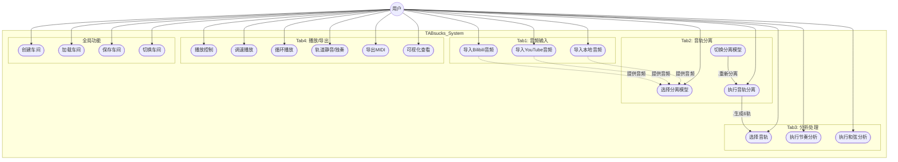
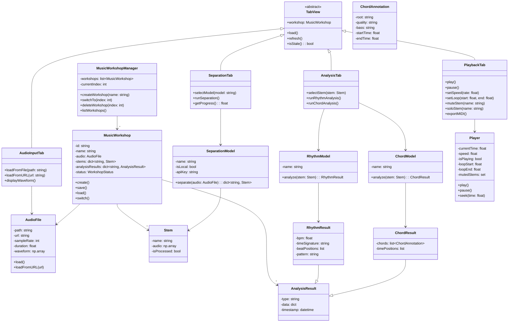
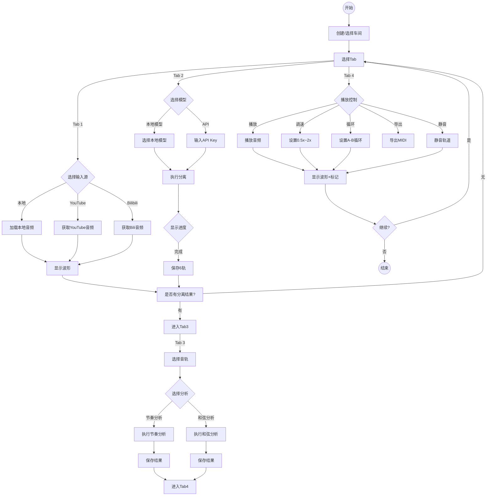
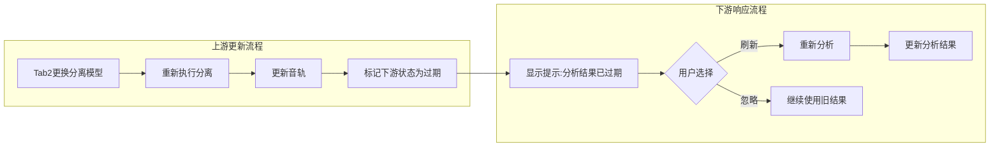
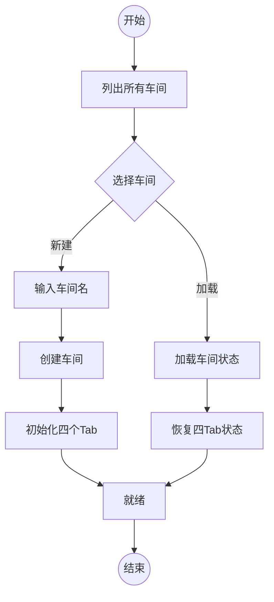
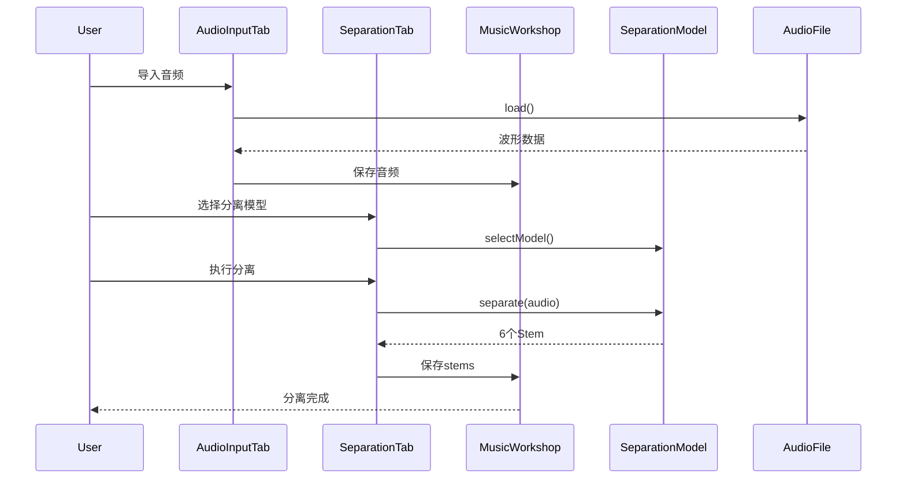
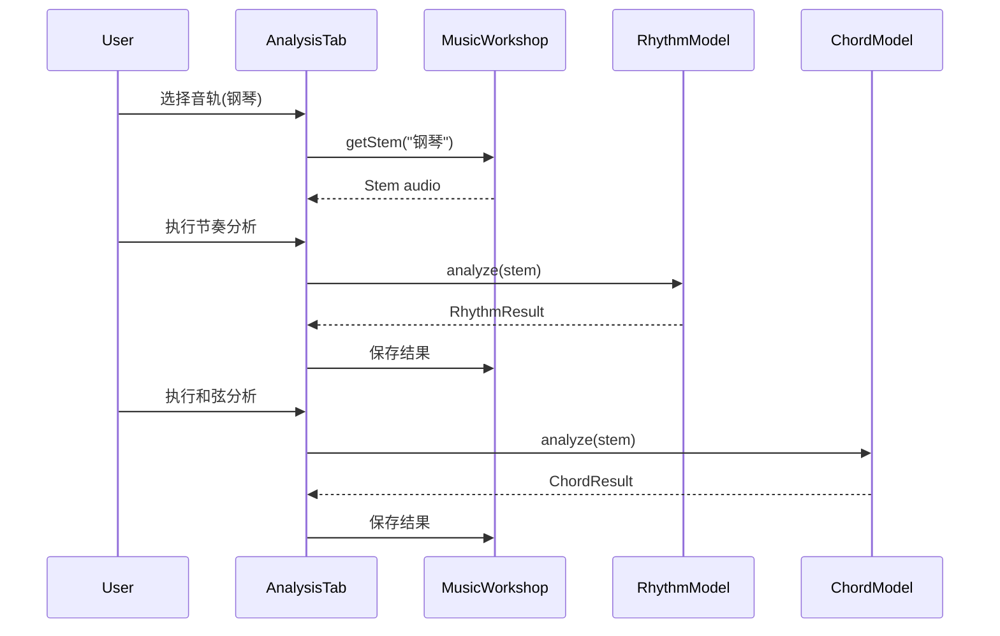
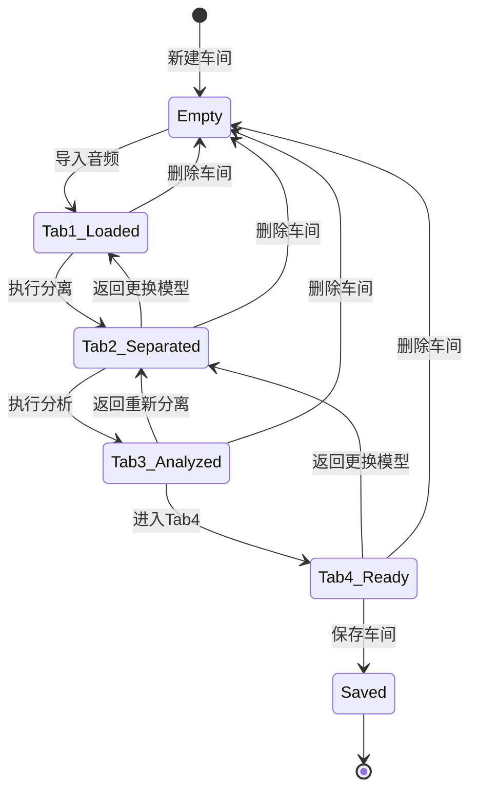
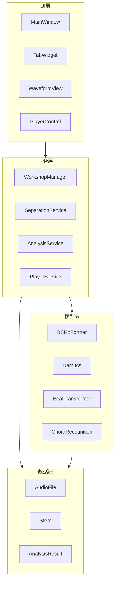
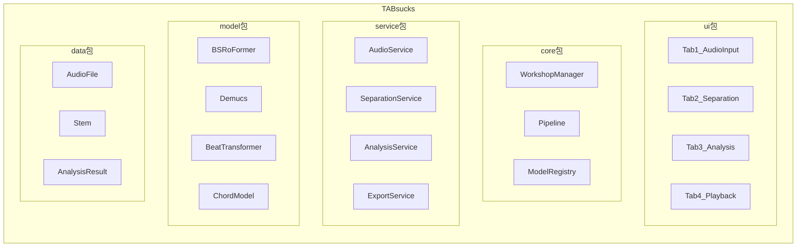

# TABsucks UML 模型文件

---

## 1. 用例图

### 1.1 系统用例图

### 1.2 用例说明

| 用例 | 描述 | 参与者 |
|-------|------|--------|
| UC1~UC3 | 音频输入（本地/YTB/B站） | Tab1 |
| UC4~UC6 | 音轨分离（选择/执行/切换） | Tab2 |
| UC7~UC9 | 分析处理（选择音轨/节奏/和弦） | Tab3 |
| UC10~UC15 | 播放/导出（播放/调速/循环/静音/MIDI/可视化） | Tab4 |
| UC16~UC19 | 车间管理（创建/加载/保存/切换） | 全局 |

---

## 2. 类图

### 2.1 核心类图

### 2.2 类说明

| 类名 | 属性 | 方法 | 说明 |
|------|------|------|------|
| TabView | workshop | load(), refresh() | 抽象Tab基类 |
| AudioInputTab | - | loadFromFile(), loadFromURL() | Tab1音频输入 |
| SeparationTab | progress | selectModel(), runSeparation() | Tab2音轨分离 |
| AnalysisTab | - | selectStem(), runRhythm/ChordAnalysis() | Tab3分析处理 |
| PlaybackTab | - | play(), setSpeed(), exportMIDI() | Tab4播放导出 |
| MusicWorkshop | name, audio, stems | create(), save(), switch() | 车间状态容器 |
| MusicWorkshopManager | workshops | createWorkshop(), switchTo() | 车间管理器 |
| AudioFile | path, waveform | load(), loadFromURL() | 音频文件 |
| Stem | name, audio | - | 分离后的单轨 |
| SeparationModel | name, isLocal | separate() | 分离模型抽象 |
| RhythmModel | - | analyze() | 节奏分析模型 |
| ChordModel | - | analyze() | 和弦分析模型 |
| Player | currentTime, speed | play(), pause(), seek() | 音频播放器 |

---

## 3. 活动图

### 3.1 主流程活动图

### 3.2 状态过期刷新流程

### 3.3 车间切换流程

---

## 4. 序列图（关键交互）

### 4.1 音轨分离序列图

### 4.2 分析处理序列图

---

## 5. 状态图

### 5.1 车间状态图

---

## 6. 组件图

### 6.1 系统组件图

---

## 7. 包图

### 7.1 系统包图

