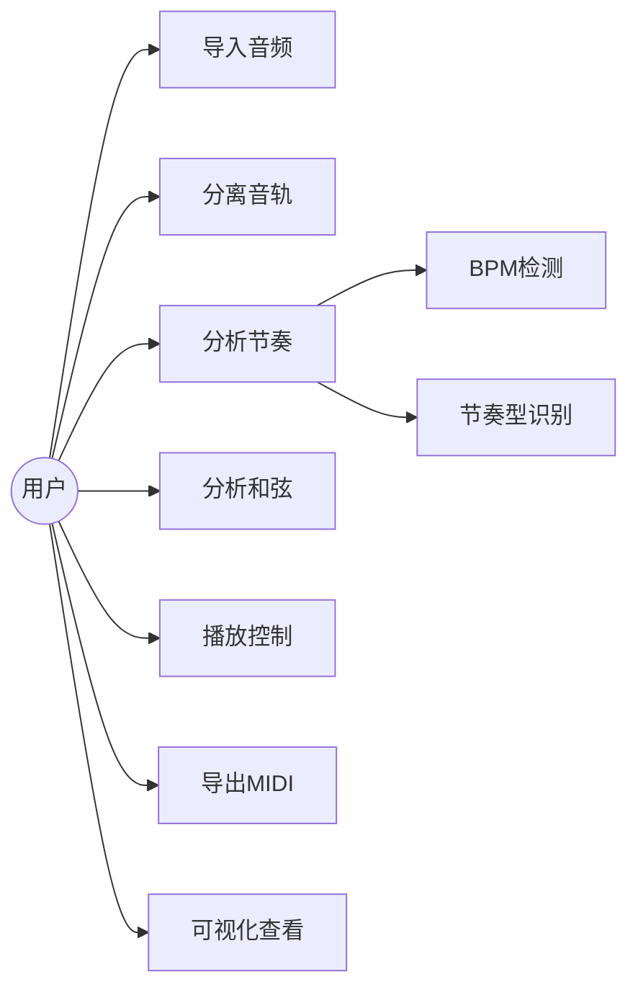
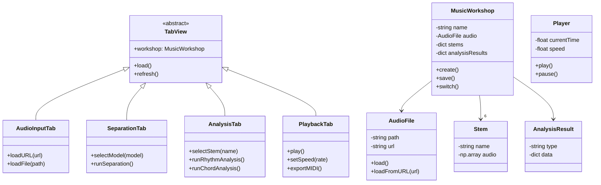

## 1. 引言

### 1.1 编写目标

本文档定义"TABsucks"软件的功能需求、非功能需求及约束条件，作为后续设计与开发的依据。本文档的预期读者包括：开发团队、项目管理方、测试团队、用户代表。

### 1.2 读者对象

- 开发团队（前端/后端/AI模型工程师）
- 项目管理方
- 测试团队
- 用户代表（乐器学习者、音乐制作人）

### 1.3 文档概述

TABsucks是一款面向音乐学习者、创作者及表演者的智能音乐分析辅助软件。核心功能包括：音频导入、音轨分离（六轨）、多轨节奏分析、多轨和弦分析、交互式播放器、可视化展示、MIDI导出。

### 1.4 术语定义

| 术语 | 定义 |
|------|------|
| **音轨分离** | 将混合音频拆分为独立乐器声部（人声、鼓、贝斯、钢琴、吉他、其他） |
| **BS-RoFormer** | ByteDance开源的音频分离模型 |
| **Beat-Transformer** | ChordMini开源的节奏分析模型 |
| **MIDI** | 乐器数字接口，用于音符事件数据传输 |
| ** stems** | 分离后的各轨道音频 |

### 1.5 参考文献

- BS-RoFormer: https://github.com/lucidrains/BS-RoFormer
- ChordMini: https://github.com/wazenmai/ChordMini（含YouTube/Bilibili音频获取能力）
- yt-dlp: https://github.com/yt-dlp/yt-dlp（YouTube/Bilibili音频下载）
- Piano Transcription: https://github.com/bytedance/piano_transcription

---

## 2. 软件系统概述

### 2.1 软件产品概述

TABsucks是一款桌面端音乐分析软件，利用AI音频处理技术将歌曲解构为可视化的音乐元素。主要应用场景：乐器学习者的跟练伴奏、扒谱，MIDI导出自制乐谱，节奏与和弦分析学习。

### 2.2 用户特征

| 用户角色 | 特征 | 使用场景 |
|----------|------|----------|
| 乐器学习者 | 有基础乐器演奏能力，希望提升技术 | 调速播放、循环A-B段、查看和弦与节奏 |
| 音乐制作人 | 具备音乐制作知识，需要快速扒谱 | MIDI导出、分离轨道的效果处理 |
| 音乐教师 | 具备教学经验 | 课堂演示、音阶/和弦分析展示 |
| 音乐爱好者 | 音乐兴趣浓厚想深入了解 | 可视化学习、歌曲结构探索 |

### 2.3 设计和实现约束

- **开源协议**：BS-RoFormer采用CC BY-NC-SA 4.0，软件须遵守该协议
- **运行环境**：Python 3.8+，支持CUDA的NVIDIA GPU（可选）
- **平台**：Windows 10/11, macOS 11+, Ubuntu 20.04+
- **模型文件**：本地存储，需网络下载（首次启动）

### 2.4 假设与依赖

- 用户具备基础计算机操作能力
- 音频文件格式为MP3/WAV/FLAC/M4A
- 网络可用于首次模型下载（后续可离线运行）

---

## 3. 功能性需求描述

### 3.1 软件功能概述（四Tab架构）

| Tab            | 功能名称   | 描述                                                       | 优先级                     |
| -------------- | ------ | -------------------------------------------------------- | ----------------------- |
| **Tab1 音频输入**  |        |                                                          |                         |
| FR-01          | 音频输入   | 支持本地文件（MP3/WAV/FLAC/M4A）、YouTube链接、Bilibili链接，获取音频后显示波形图 | P0                      |
| **Tab2 音轨分离**  |        |                                                          |                         |
| FR-02          | 分离模型选择 | 显示本地可用模型、自动推荐最优模型、API Key接入                              | P1                      |
| FR-03          | 音轨分离   | 分离为6轨（人声/鼓/贝斯/钢琴/吉他/其他）支持进度显示，至少一个模型BS-RoFormer          | P0                      |
|                |        |                                                          |                         |
| **Tab3 分析处理**  |        |                                                          |                         |
| FR-04          | 音轨选择   | 从分离结果中选择目标音轨进行分析                                         | P0                      |
| FR-05          | 节奏分析   | BPM、拍号、节拍位置、常见节奏型识别                                      | P1                      |
| FR-06          | 和弦分析   | 301类和弦识别，输出和弦级数与时间轴                                      | P0                      |
| **Tab4 播放/导出** |        |                                                          |                         |
| FR-07          | 播放控制   | 播放/暂停、跳转、调速（0.5x~2x）、循环A-B段                              | P0                      |
| FR-08          | 轨道控制   | 各轨道独立静音/独奏                                               | P1                      |
| FR-09          | 可视化    | 波形、节拍标记、和弦标签、节奏型图谱                                       | P0                      |
| FR-10          | MIDI导出 | 将分离轨导出为标准MIDI文件                                          | P1                      |
| **全局**         |        |                                                          |                         |
| FR-11          | 音乐车间   | 新建/加载/保存/切换车间，一个车间 = 一段音频 + 四个Tab的状态                     | P0                      |
|                |        |                                                          |                         |
| FR-05          | 个性化插件  | 利用核心分析得出的结果，可以选择性地进行更加高级细致的分析处理                          | 通过PluginManager调用各种拓展插件 |
### 3.2 用例模型

### 3.3 分析模型（类图 - 四Tab架构）

| 类名 | 职责 |
|------|------|
| Pipeline | 工作流编排器，串联各处理节点 |
| MusicWorkshop | 音乐车间，一个车间对应一段音频和一个工作流，支持创建/加载/保存/运行 |
| SeparatorNode | 音轨分离节点，模型可切换 |
| RhythmNode | 节奏分析节点 |
| ChordNode | 和弦分析节点 |
| ModelSelector | 模型选择器，支持本地模型检测、API Key接入 |
| Player | 播放控制、速度调节、循环设置 |
| MIDIExporter | MIDI文件生成与导出 |

---

## 4. 非功能性需求

| 类别 | 需求 | 衡量指标 |
|------|------|----------|
| **性能** | 5分钟歌曲的分离+全部分析时间 | ≤2分钟（GPU模式） |
| **可用性** | 新用户可独立完成基本操作 | 测试成功率≥90% |
| **安全性** | 所有处理本地完成，不上传用户音频 | 无网络传输 |
| **可维护性** | 分离引擎支持插拔切换 | 模块化设计 |
| **可扩展性** | 支持新增分析插件 | 预留插件接口 |
| **资源占用** | CPU模式内存 / GPU模式显存 | ≤4GB / ≤2GB |
| **兼容性** | 支持的操作系统 | Windows/macOS/Ubuntu |

---

## 5. 界面需求

| 需求项 | 描述 |
|--------|------|
| 主界面布局 | 顶部工具栏 + 中间波形/可视化区域 + 底部轨道控制面板 |
| 导入按钮 | 支持拖拽或文件选择器 |
| 进度条 | 显示分析进度百分比 |
| 轨道开关 | 每个分离轨道的独立静音/独奏按钮 |
| 速度滑块 | 0.5x ~ 2x 连续可调 |
| 循环标记 | 可视化A-B段标记 |
| 导出菜单 | MIDI导出选项 |

*界面风格待定（可选择深色/浅色主题）*

---

## 6. 接口定义

*待定，需进一步讨论以下问题：*

| 接口类型 | 待确认项 |
|----------|----------|
| 插件接口 | 分析插件的接口规范（如调式分析、音阶识别） |
| 模型接口 | 分离引擎的抽象层定义（支持Demucs等其他模型） |
| 文件接口 | MIDI导出的字段定义 |
| 国际化 | 多语言支持（中文/英文） |

---

## 7. 进度要求

*待项目管理方确认*

---

## 8. 交付要求

- 可运行的桌面端应用程序（Windows/macOS/Ubuntu）
- 安装包或绿色版
- 用户手册（使用说明）
- 模型文件（首次下载或内置）

---

## 9. 交付形式

*待讨论：*

- 可执行文件（.exe/.app）
- Docker镜像
- Python包（pip install）

---

## 10. 验收要求

*待测试团队确认*

---
