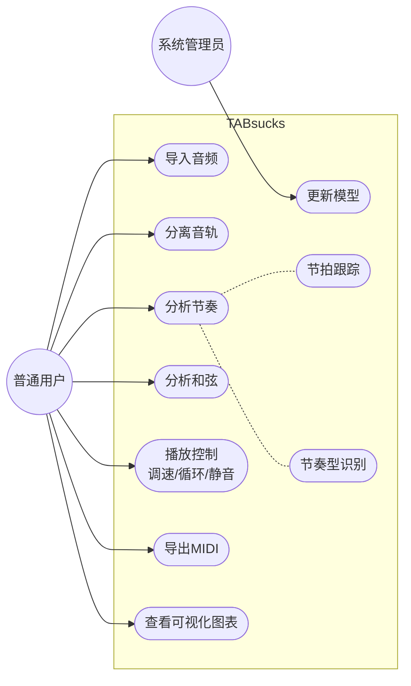
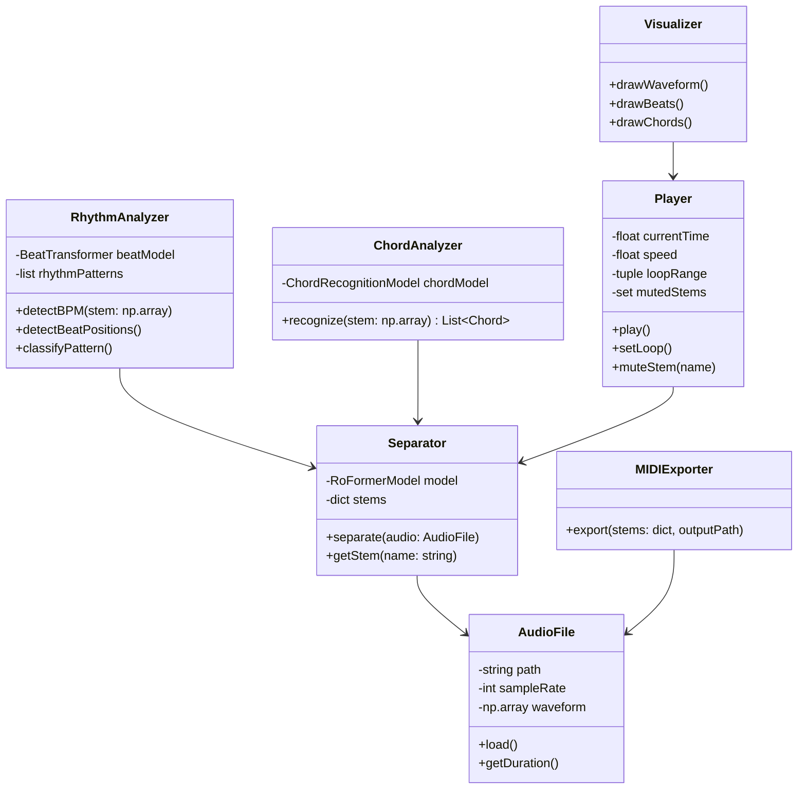
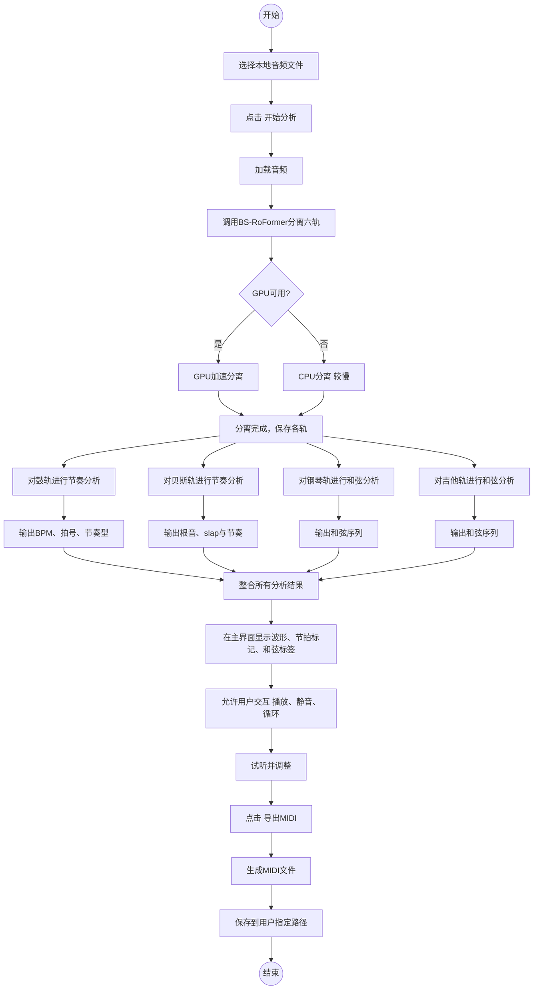

## 一、项目构思说明

### 系统目标

**“TABsucks”** 是一款面向音乐学习者、创作者及表演者的智能音乐分析辅助软件。其核心目标是：利用先进的AI音频处理技术，将任意一首歌曲“解构”为可视化的音乐元素——包括多轨分离、节奏律动识别、和弦进行、旋律轮廓等，并以此为基础提供交互式的练习、扒谱和再创作功能。

### 用户群体

1. **乐器学习者**（吉他、钢琴、贝斯、鼓等）：希望放慢歌曲、消除原乐器轨、看清和弦与节奏，从而跟练。
2. **音乐制作人/编曲者**：需要快速扒谱、提取分轨MIDI、分析编曲手法。
3. **音乐教师**：用于课堂演示、制作教学素材。
4. **音乐爱好者**：想深入了解自己喜欢的歌曲结构。

### 预期应用场景

- **场景A（练琴）**：吉他手导入一首流行歌，软件分离出吉他轨，显示该轨的和弦指法、扫弦节奏型（如“下 下上 上下上”），并允许调速、循环片段。
- **场景B（扒谱）**：制作人想翻编一首歌，软件一键输出钢琴、贝斯、鼓、人声的MIDI轨道。
- **场景C（节奏训练）**：学生练习Swing节奏，软件实时检测用户演奏（通过麦克风），与歌曲原版节奏进行对比并给出评分。

### 创新点

1. **多轨独立和弦分析**：不同于现有软件只给出一个全局和弦序列，TABsucks对分离后的钢琴、吉他、贝斯分别进行和弦识别，能捕捉到转位和弦、低音走向、吉他指法细节。
2. **节奏律动可视化**：不仅显示BPM和拍号，还能识别三连音、Swing、切分、顿音等节奏型，并以打击乐卷帘或节奏谱形式呈现。
3. **特殊演奏技巧的识别**：对于贝斯音轨，不仅做节奏识别，还可以自研加入一个“Slap/Finger”风格识别的小模型。

### 可行性分析

- **技术支撑**：音轨分离采用BS-RoFormer（已有轻量版46.8M模型），节奏分析集成ChordMini的Beat-Transformer，和弦识别使用ChordMini的301分类模型。以上均为开源且可本地部署。
- **硬件要求**：支持GPU加速，同时提供CPU降级模式（处理速度较慢但可用）。
- **开发难度**：核心模型已有成熟实现，主要工作量在于前端界面、多模型流水线编排、以及交互优化。团队需具备Python/PyTorch、Qt/PyQt或Web前端能力。

### 系统意义与价值

填补了“专业级多轨音乐理解”在个人用户领域的空白。现有工具要么分离质量一般（如Audio Jam使用Spleeter），要么分析维度单一（ChordMini无分离）。TABsucks将两者深度整合，并加上练习辅助功能，有望成为音乐学习者的“AI导师”。

---

## 二、软件需求规格说明书（SRS）

### 1. 引言

#### 1.1 目的

本文档定义“TABsucks”软件的功能需求、非功能需求及约束条件，作为后续设计与开发的依据。

#### 1.2 范围

TABsucks是一款桌面端应用（Windows/macOS/Linux），后续可扩展移动端。核心功能包括：音频导入、音轨分离、多轨节奏分析、多轨和弦分析、交互式播放器（调速、循环等）、MIDI导出。

### 2. 总体描述

#### 2.1 用户角色

- **普通用户**：使用所有分析功能，进行播放控制，额外可使用MIDI导出、参数调节（分离模型选择、重叠度等）。
- **系统管理员**：管理模型更新、日志查看（仅离线版本可选）。

#### 2.2 运行环境

- **操作系统**：Windows 10/11, macOS 11+, Ubuntu 20.04+
- **硬件**：建议8GB RAM，支持CUDA的NVIDIA GPU（可选）
- **依赖**：Python 3.8+，PyTorch，ONNX Runtime

### 3. 功能需求

| 编号    | 功能名称   | 描述                                       | 技术实现                                  |
| ----- | ------ | ---------------------------------------- | ------------------------------------- |
| FR-01 | 音频导入   | 支持MP3, WAV, FLAC, M4A等格式，显示波形图           | librosa / soundfile                   |
| FR-02 | 音轨分离   | 分离为人声、鼓、贝斯、钢琴、吉他、其他六轨，支持进度显示             | 集成BS-RoFormer（轻量版46.8M）               |
| FR-03 | 多轨节奏分析 | 对分离后的每个轨道进行节拍跟踪，输出BPM、拍号、重拍位置，并识别常见节奏型   | 调用ChordMini的Beat-Transformer，后处理识别节奏型 |
| FR-04 | 多轨和弦分析 | 对钢琴、吉他、贝斯轨分别进行和弦识别，输出和弦标签及时间轴            | 调用ChordMini的和弦识别模型（301类）              |
| FR-05 | 交互式播放器 | 支持播放/暂停、跳转、调速（0.5x~2x）、循环A-B段、各轨道独立静音/独奏 | PyAudio / Qt Multimedia               |
| FR-06 | 可视化展示  | 同步显示波形、节拍标记、和弦标签、节奏型图谱                   | Matplotlib / Qt Charts                |
| FR-07 | MIDI导出 | 将钢琴、贝斯、鼓、人声旋律轨导出为标准MIDI文件                | 音符事件生成 + midiutil                     |
|       |        |                                          |                                       |

### 4. 非功能需求

| 类别 | 需求描述 | 衡量指标 |
|------|----------|----------|
| **性能** | 一首5分钟歌曲的分离+全部分析总时间不超过2分钟 | 实测计时 |
| **可用性** | 界面直观，新用户无需教程即可完成基本分离与播放 | 用户测试成功率≥90% |
| **安全性** | 不联网发送用户音频数据，所有模型本地运行；MIDI导出不包含原音频 | 代码审计 |
| **维护性** | 模型文件可独立更新，分离引擎可插拔（支持切换Demucs等） | 模块化设计 |
| **可扩展性** | 支持添加新的分析插件（如调式分析、音阶识别） | 插件接口 |
| **资源占用** | CPU模式下内存占用≤4GB，GPU模式下显存占用≤2GB | 任务管理器监控 |

### 5. 约束条件

- **开源协议限制**：BS-RoFormer模型权重采用CC BY-NC-SA 4.0，软件须同样非商业使用（若开源可豁免）。
- **平台依赖**：需安装Python环境，初次启动可能自动下载模型文件（需网络）。

---

## 三、UML模型图

### 1. 用例图

### 2. 类图（核心类）

### 3. 活动图

