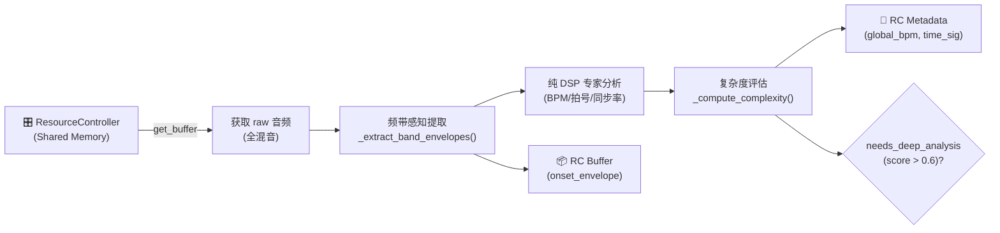
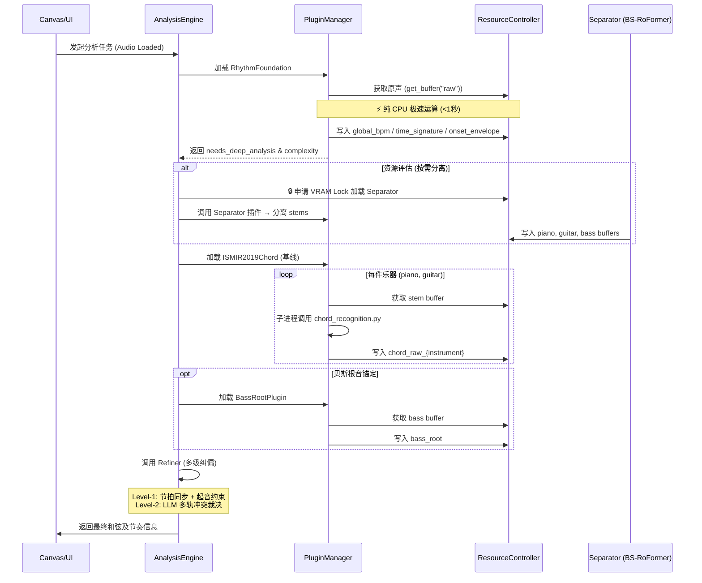
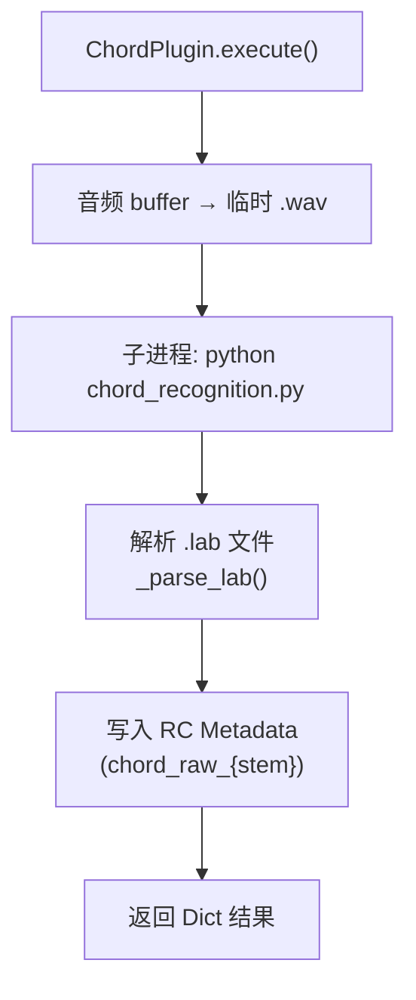

---

# 基础节奏与和弦识别模块开发日志
> 本文档记录 P1 阶段基础节奏探测模块（Phase A+B）与基线和弦识别模型的架构设计、插件化封装决策、与 `ResourceController (RC)` / `PluginManager (PM)` 的集成逻辑，以及高性能算法细节，供团队成员查阅。

---

## 一、模块概述

### 1.1 节奏模块
位于 `src/plugins/rhythm`。在 `AnalysisEngine (AE)` 的业务流中，它是**前置侦察兵**：
- 运行于**音轨分离之前**，通过 `RC` 共享内存获取未分离的混音数据。
- 使用极低 CPU 占用的纯 DSP 算法（基于 `madmom`）极速扫描全局音频。
- 获取全局 BPM、预判拍号，并计算律动复杂度 `complexity_score`。
- **决定是否触发后续重型分离模型与深度节拍跟踪模型**（Phase C），是整个资源调度阀门。

### 1.2 和弦识别模块 (`chord_ismir2019`)
位于 `src/plugins/chord/ismir2019.py`。作为基线模型，追求**开箱即用与忠实复现**：
- 封装 `music-x-lab/ISMIR2019-Large-Vocabulary-Chord-Recognition` 仓库，通过子进程调用官方 `chord_recognition.py` 脚本。
- 输入为 BS-RoFormer 分离后的纯乐器音轨（如钢琴、吉他、贝斯）。
- 输出组件化的和弦标签（根音、性质、低音等），结果通过 `RC` 元数据回写，供后续 `Refiner` 进行多级纠偏。

### 核心依赖汇总

| 依赖 | 用途 |
|------|------|
| `madmom` | 节奏模块 DSP 算子（STFT, 梳状滤波 TempoEstimation） |
| `numpy` | 矩阵运算、拍号自相关与频段同步率计算 |
| `librosa`, `soundfile` | 和弦识别临时文件生成、音频重采样 |
| `subprocess` | 调用 ISMIR2019 官方推理脚本 |
| `src.core.ResourceController` | 架构核心：内存/显存调度、Buffer 提取、元数据回写（这个我们等打通了所有流程之后再来优化） |

---

## 二、架构设计

### 2.1 基础节奏分析数据流



### 2.2 模块在 AnalysisEngine 中的全流程调度



### 2.3 和弦识别插件内部封装逻辑



---

## 三、核心数据结构

### 3.1 FoundationRhythmResult

```python
@dataclass
class FoundationRhythmResult:
    global_bpm: float
    bpm_map: List[Tuple[float, float]]       # [(时间戳_秒, 局部BPM), ...]
    time_signature_guess: str                # 预估拍号，例如 "4/4", "7/8", "Mixed"
    complexity_score: float                  # 0.0 ~ 1.0，分数越高代表律动越复杂
    needs_deep_analysis: bool                # 核心开关：是否建议调用重型模型
```

**设计说明**：
- `needs_deep_analysis`: 贯穿微内核设计的核心“阀门”。简单流行乐避免不必要的分离耗时。

### 3.2 和弦输出标准化格式 (ISMIR2019)

经 `_parse_lab()` 解析后，和弦数据在 `RC` 中以 List[Dict] 形式存储：

```python
chord_data = [
    {"start": 0.0, "end": 2.5, "chord": "C:maj"},
    {"start": 2.5, "end": 5.0, "chord": "G:7"},
    ...
]
```

此格式直接对接下游 `Refiner` 的节拍对齐和纠偏逻辑。

---

## 四、函数详解

### 4.1 节奏模块核心 DSP 算子

#### `_extract_band_envelopes(samples, sr, fps, split_freq=150)`
- **核心逻辑**：基于 `madmom.audio.stft` 计算单次 STFT。以 150Hz 为界，高低频分别进行 Spectral Flux 正向差分。
- **物理意义**：低频包络代表 Kick/Bass；高频包络代表 Snare/Hi-hat。

#### `_detect_time_signature(low_env, global_bpm, fps)`
- **核心逻辑**：在低频频段对拍间隔的 3、4、5、7 倍滞后点做自相关峰值检测。
- **物理意义**：底鼓的循环周期即基础小节线，低成本侦测奇数拍。

#### `_calculate_band_sync(low_env, high_env)`
- **核心逻辑**：皮尔逊相关系数。
- **物理意义**：分数越低，频段时间轴越错开（切分音、幽灵音等），显著拉升复杂度。

### 4.2 和弦识别插件核心方法

#### `execute(rc: ResourceController, stem_name='piano')`
- 从 `RC` 获取指定纯乐器音频 buffer。
- 写入临时 `.wav` 文件，调用官方 `chord_recognition.py` 推理，输出 `.lab` 文件。
- 解析 `.lab` 并将 List[Dict] 写回 `RC.set_metadata(f"chord_raw_{stem}")`。
- 返回标准执行状态。

#### `_parse_lab(lab_path) -> List[Dict]`
- 解析 ISMIR2019 输出的标签文件（格式：`start\tend\tchord`）。
- 处理可能存在的异常行、空行，保证鲁棒性。

---

## 五、算法路线对比与决策

### 5.1 基础节奏探测：纯 DSP vs. 深度模型

| 方案 | 算力/显存 | 耗时 | 适用阶段 | 决策 |
|------|----------|------|---------|------|
| 纯 DSP (Madmom) | 极低 (纯 CPU) | <1秒 | 前置侦察 | ✅ 采用 |
| 深度模型 (RNNBeat) | 高 (需 GPU) | 较长 | 复杂节奏后置补救 | 仅当 `complexity>0.6` 时挂载 |

**决策**：前置阶段必须零显存占用，`madmom` 的梳状滤波足以给出宏观轮廓，分流 80% 标准曲目。并且有复用机制：后续重型节拍跟踪或和弦识别后缀可直接取用前面基础节奏的包络结果（已写入缓存中），杜绝重复 STFT。

### 5.2 和弦识别基线：子进程调用 vs. 直接嵌入模型

| 方案 | 集成难度 | 稳定性 | 忠实度 | 未来迁移性 |
|------|---------|--------|--------|-------------|
| **子进程调用官方脚本** | **极低** | **极高** | **100% 复现原论文** | 可随时替换为 PyTorch 直接加载 |
| 直接 import 内部 model.py | 高（需完整解构内部 API） | 低（仓库更新即失效） | 取决于手动改写精度 | 高但维护成本大 |

**决策**：作为 MVP 基线，选择子进程封装。插件仅做数据准备和结果收割，代码量极小，且能确保与 `music-x-lab` 官方评测完全一致。未来若有高性能需求，再按相同接口封装 `ChordFormer` 或 `BTC-PL` 模型。

### 5.3 为何对分离后纯乐器音轨分别进行和弦识别？

- **物理合理性**：贝斯决定根音/低音，钢琴/吉他提供完整泛音列，鼓和人声不含调性信息。
- **低音锚定**：贝斯专用轻量根音插件，对比钢琴结果，能精准检测转位和弦（如 `C/E`）。
- **噪声剔除**：BS-RoFormer 分离后，打击乐瞬态和主唱谐波不再干扰谐波提取，误识率大幅下降。
- **并行可能**：各音轨和弦识别可并行调度，充分利用 `ResourceController` 的多模型加载池。

---

## 六、设计决策记录

### 6.1 节奏模块前置
**决策**：在分离前运行纯 DSP 节奏分析，用微小算力判断是否值得分离鼓组进行深度节奏分析。避免一上来就加载计算密集的 BS-RoFormer。

### 6.2 回写元数据到 ResourceController
**决策**：所有插件结果均通过 `RC.set_metadata()` 回写。后续 `Refiner` 或前端可直接通过键名（如 `global_bpm`, `chord_raw_piano`）获取，实现全链路解耦。

### 6.3 Python 3.10+ 防御性编程
**决策**：`madmom` 依赖老式 `collections` 接口，在导入阶段用 monkey patch 向后兼容，保证在 CI 环境顺利运行。

### 6.4 和弦模型采用子进程调用而非直接加载
**决策**：ISMIR2019 仓库提供了完美的端到端脚本，我们选择“薄封装”策略，最大化稳定性和可复现性。插件目前仅依赖 `subprocess`、`soundfile` 和 `librosa`。

---

## 七、后续待办

| 优先级 | 内容 | 说明 |
|--------|------|------|
| **P1** | **集成至 `AnalysisEngine`** | 注册 `RhythmFoundation` 和 `ChordISMIR2019` 插件，跑通全链路。 |
| **P1** | **实现 `Refiner` 模块** | 完成 Level-1（节拍同步+起音约束）及 Level-2（LLM 多轨冲突裁决）的代码编写。 |
| **P2** | **开发 `deep_rhythm` 插件** | 当 `needs_deep_analysis=True` 且鼓组分离就绪时，挂载 AI 节拍跟踪。 |
| **P2** | **封装 `bass_root` 插件** | 实现轻量贝斯根音检测，为纠偏提供关键辅证。 |
| **P3** | **添加高精度和弦选项** | 按同一 `BasePlugin` 接口封装 `BTC-PL` 或 `ChordFormer` 作为可切换模型。 |
| 建议 | **前端数据对接** | 将 `bpm_map`、`onset_envelope` 及和弦序列通过 WebSocket 推送到 UI Canvas。 |

---

## 八、文件清单

```text
src/plugins/rhythm/
├── __init__.py
├── utils.py                    # 纯 DSP 工具函数 (to_mono, extract_band_envelopes 等)
├── rhythm_foundation.py        # 基础节奏插件 (Phase A+B)
├── manifest.json               # 插件资源声明
├── deep_rhythm.py              # (未来) 高级节拍跟踪插件 Phase C

src/plugins/chord/
├── __init__.py
├── manifest.json               # 和弦插件资源清单
├── ismir2019.py         # ISMIR2019 基线和弦识别插件
├── btc_sl.py            # (未来) BTC-SL 模型封装
├── bass_root.py         # (未来) 贝斯根音锚定插件
└── external/
    └── ismir2019/              # Git 子模块：music-x-lab/ISMIR2019 仓库

src/core/
├── resource_controller.py      # (待实现) RC 接口：设备分配、Buffer、元数据读写
├── plugin_manager.py           # (待实现) 插件注册、发现、生命周期管理
└── analysis_engine.py          # (待实现) 业务编排器

```

---