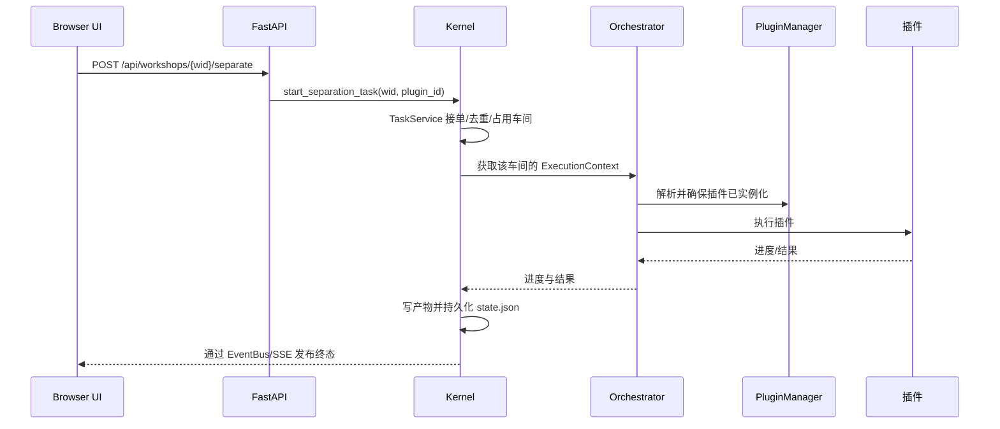

# 插件编排与运行时契约

本文说明当前实现。早期版本的分支来源、测试数量和未来计划已归档在开发日志中，不作为现行实现说明。

## 调用路径

分离与逐轨分析由 `Kernel` 委托 `WorkshopJobs`，通过 `TaskService` 接单，随后由 `Orchestrator` 通过当前车间的 `PluginManager` 获取插件。Orchestrator 仅报告进度和执行结果；WorkshopJobs 组织产物提交，Workshop 在产物与状态成功持久化后发布单次终态。SSE 断线后用任务查询接口恢复状态。图中的 Kernel 步骤包含其委托的 WorkshopJobs 服务。

## 隔离与资源管理

- 每个 Workshop 持有独立的 `ExecutionContext`：`ResourceController`、`PluginManager` 和 `AnalysisEngine` 不跨车间共享。
- 同一 Workshop 从输入导入、解码、推理直到提交终态只允许一项修改任务；重复请求复用同一任务 ID，冲突返回 409。进程级 GPU 信号量限制 GPU 插件并发。纯 CPU 任务不占用此 GPU 信号量。
- `ResourceController` 使用线程锁保护运行时字典，并提供模型缓存和 VRAM 预算接口。VRAM 预算是运行前检查/记账，不等同于操作系统显存隔离。
- Workshop 关闭、删除或 Kernel 异步退出先停止接单，再取消/排空工作线程和提交，最后清理上下文。同步模型只能等待退出，不能强制抢占。

RC 的音频专用接口存储 `float32 (channels, samples)` 和每缓冲采样率；单声道输入也保持二维。插件需要一维单声道时在入口转换。WAV stem 以 FLOAT subtype 保存，重载后精度与在线分析一致。原音频解码预算默认 1024 MiB，可由 `TABSUCKS_AUDIO_MEMORY_BUDGET_MB` 调整。

## 分离插件契约

API 默认插件 ID 为 `separation_bs_roformer`。历史显示名称 `BS-RoFormer`、`BS-RoFormer-SW`、`BS-Roformer-SW` 及旧模型文件标签映射到同一真实插件 ID。默认分离不自动调用 `example_separator`。

插件通过 manifest 声明入口、阶段、输入、输出、依赖及资源需求。PluginManager 延迟导入并实例化 manifest 插件。缺少入口、依赖或模型资源时，任务以 `separation_failed` 报告明确原因；manifest 被发现本身不等于当前环境具备可推理条件。

示例插件仍可在 UI/API 明确选择 `example_separator` 时用于开发和演示，其输出为模拟数据。

## 分析路径边界

Tab3 的正常路径按用户选择调用单个 manifest 分析插件，例如 `chord_ismir2019` 或 `chord_btc_sl`。当前可用和弦插件以 `src/plugins/chord/manifest.json` 为准；`chord_chordnet_2e1d` 已删除，不是有效插件 ID。

`AnalysisEngine.run()` 保留完整流水线代码，但 UI 目前没有调用它。它属于尚待整合的路径；如要将其作为正式产品流程，需另行接通任务入口并完成端到端验证。当前 API 文档不得声称逐轨分析会自动执行整条流水线。

该流水线的分离阶段也只使用 manifest 插件；插件不可用时明确失败，不再回退到已移除的 `separator_old_type.py`。

## 主要实现位置

| 职责 | 文件 |
|---|---|
| 任务入口与车间生命周期 | `src/kernel/kernel.py` |
| 任务监督、音频装载和产物提交 | `src/kernel/core/workshop_jobs.py` |
| 唯一线程安全事件总线 | `src/kernel/core/event_bus.py` |
| 插件编排、隔离和 GPU 并发 | `src/kernel/core/kernel_orchestrator.py` |
| manifest 发现、实例化和资源检查 | `src/kernel/core/plugin_manager.py` |
| 单体分析流水线（当前未接入 UI 主路径） | `src/kernel/core/analysis_engine.py` |
| HTTP 插件枚举 | `src/ui/api/plugins.py` |
| API 任务入口 | `src/ui/api/analysis.py` |

## CI 基线

`ci.yml` 覆盖 Ruff correctness 子集 `E9,F63,F7,F82`、排除 slow/network 标记的 pytest 用例，以及 JavaScript Node 测试，不构建桌面安装包或运行 mypy。另有独立 `codeql.yml` 安全分析工作流，其远端结果不属于本地测试结论。随 CI 改动应同步更新本节与 README。
