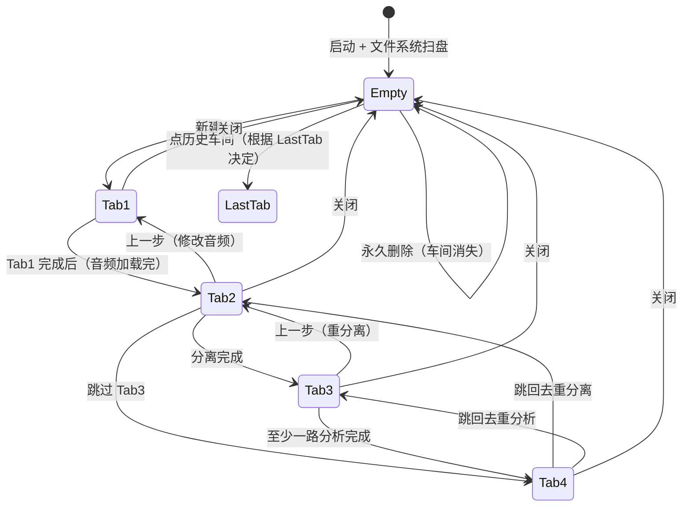
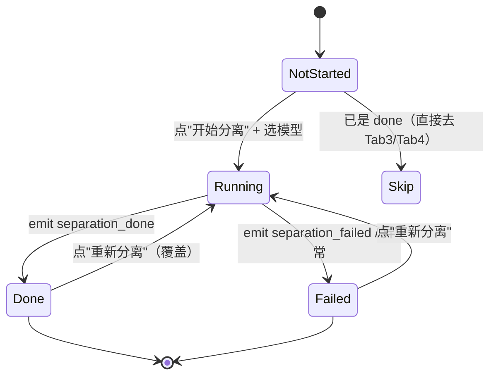
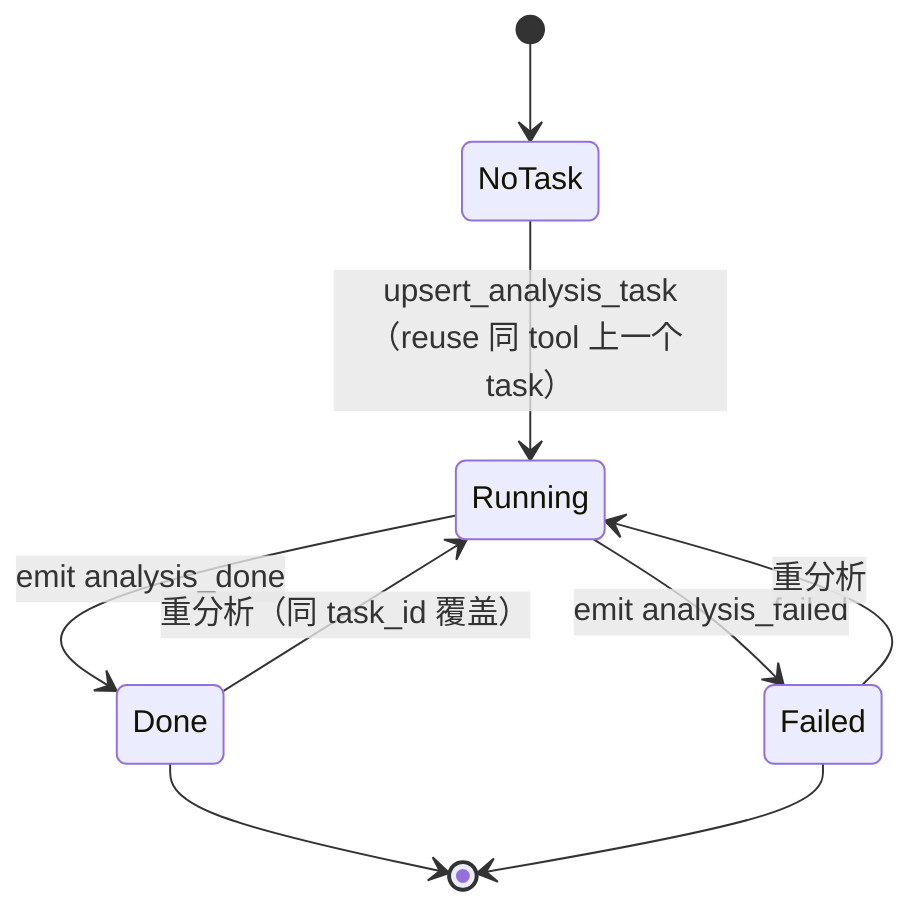
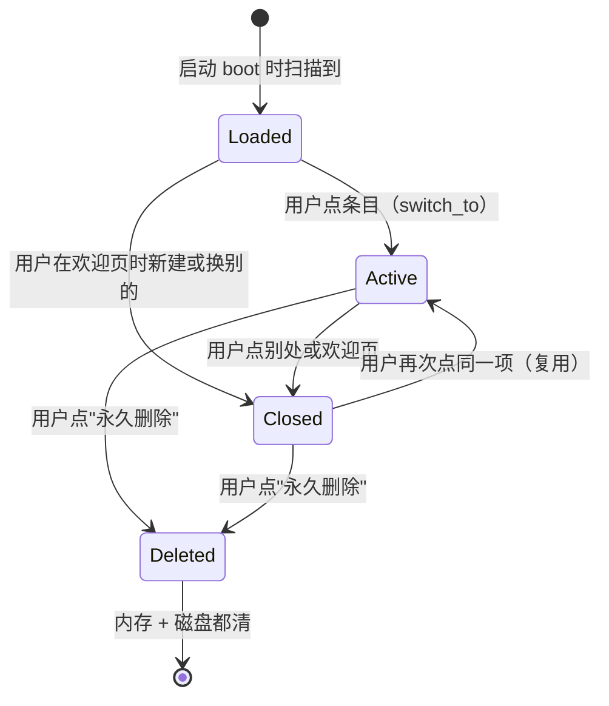

# 用户行为逻辑与业务逻辑梳理

> 来源：团队 2026-07-12 讨论。
> 目的：把"用户做什么 / 业务做什么"对齐到具体模块，为后续代码 / UI 实现提供契约。

---

## 一、原文摘要

### 1. 打开软件
* **用户**：左侧边栏 = 历史车间记录；右主界面 = 欢迎界面，提供"新建车间"入口。
* **业务**：进程初始化；文件系统扫盘 → 把 `cache/workshop_*/` 里的车间按时间排序呈现；历史 = 之前持久化的工作流。
* **类比**：chatgpt 网页版 → 左侧历史会话 / 右侧"新建对话"。

### 2. 主界面（侧边栏）
* **用户**：点历史记录 → 激活该车间，右主界面显示**上次离开时所在的 Tab**；点"新建车间" → 激活新车间，进入 Tab1。
* **业务**：switch_to / create 后，`WorkshopState.LastTab` 决定从哪个 Tab 开始；新建车间 `LastTab = "Tab1"`。

### 3. Tab1 — 音频输入
* **用户**：看到两个选项：本地上传 / URL 上传。
  * URL：弹出输入框 → 粘贴 URL → 点击"继续 / 下一步" → 后端下载音频 → 进入 Tab2。
  * 本地：选择文件 → 显示文件名 → 点击"继续 / 下一步" → 读取并落盘 → 进入 Tab2。
* **业务**：`audio/loader.py` 模块（URL 合法性 → yt-dlp 下载 / 本地 load → AudioData）；`MusicWorkshop.set_raw_audio(...)` 更新 state + 落盘 + emit `raw_audio_set`。

### 4. Tab2 — 音轨分离
* **用户**：下拉选择分离模型 → 点击"开始分离 / 下一步 / 继续" → 看到进度 → 完成后看到 6 道音轨 → 可重复选模型重跑 / 已跑过 Tab2-Tab3-Tab4 流程可跳到 Tab4。
* **业务**：
  * `SeparatorPluginManager` 扫盘注册已有模型 → UI 下拉列表。
  * 启动分离任务 → 更新 state → RC 分配显存 / CPU → 创建模型实例 → AE 编排 → 返回进度 → UI 显示进度 → 写盘结果 → 更新 state → emit 事件链。

### 5. Tab3 — 音轨分析
* **用户**：看到已分离的音轨 → 点某条 → 选择分析方法（节奏 / 和弦） → 选工具 → 点"开始分析" → 看到进度 → 完成 → 可跳到 Tab4 / 也可回 Tab2。
* **业务**：
  * `AnalysisPluginManager` 扫盘注册工具 → UI 列表。
  * 任务开始 → 更新 state → RC 分配资源 → 创建工具实例 → AE 编排 → 进度 → 写盘 → 更新 state → emit 事件。

### 6. Tab4 — 播放 / 可视化
* **用户**：
  * 默认显示音轨波形
  * 可为每个音轨选择已有分析结果的可视化
  * 播放音乐（按混音状态）
  * 静音 / 调音量 / 定位 / 暂停
  * 可视化随播放头同步滚动
  * 可跳到 Tab2 / Tab3
  * 可导出 MIDI（隐含在"等等"里）
* **业务**：UI 渲染 + 播放器播放 + MIDI 导出（MidiExporter）+ 6 轨混合（`MusicWorkshop.get_mix_audio()`）。

---

## 二、各阶段 × 模块行为映射

> **缩写**：
> * WS = `MusicWorkshop`（runtime）/ WM = `WorkshopManager`
> *  CACHE = `WorkshopCache`，FILESYSTEM = `cache/workshop_<id>/...`
> * PM-Sep = `SeparatorPluginManager`，PM-Analysis = `AnalysisPluginManager`
> * RC = `ResourceController`（显存 / 模型锁 / buffer）
> * AE = `AnalysisEngine`（编排）
> * SE = `SeparatorPlugin`，AP = `AnalysisPlugin`
> * UI = 前端（app.js 等），HTTP = FastAPI 路由
> * KERNEL = `src/kernel/kernel.py`

### 2.1 打开软件阶段

| 用户行为 | WS / WM | CACHE | KERNEL | UI | HTTP | 其他 |
|----------|---------|-------|--------|----|------|------|
| 打开浏览器访问 `http://localhost:8000` | — | — | — | 加载 `index.html` | `GET /` 返回 shell | — |
| 显示侧边栏 + 欢迎界面 | — | — | — | 调 `api.listWorkshops()` | `GET /api/workshops` | — |
| 浏览器读历史 | — | — | — | — | `GET /api/workshops` → `m.list_workshops()` | — |
| 文件系统扫盘 | — | — | `kernel.boot()` → `WM.load_all()` 调用 `CacheManager.list_workshop_ids()` | — | — | — |
| 跳过的坏 `state.json` | — | — | `load_all()` 捕获 `ValidationError` / `JSONDecodeError` → 跳过 + emit `workshop_load_failed` | — | — | — |
| 建立 SSE | — | — | — | `stream.connect()` → `/api/events` 订阅 | SSE 长连：每个连接独占一个 `EventBus.subscribe()` Queue | — |

### 2.2 新建车间

| 用户行为 | WS / WM | CACHE | KERNEL | UI | HTTP | 其他 |
|----------|---------|-------|--------|----|------|------|
| 点"新建车间"按钮 | WM.create("New Workshop") | mkdir `workshop_<id>/{raw_audio,track_audio,analysis_result}/`；立即落空 `state.json` | `Kernel.create_workshop(name)` 调用之；emit `workshop_created` | `api.createWorkshop()` → 调 `refreshWorkshopList()` → 显示新条目 | `POST /api/workshops` | — |
| 自动激活新建车间 | `MusicWorkshop._autosave_enabled=True` → 起 5 秒线程；`active_id = wid` | — | — | — | — | — |
| 跳转 Tab1 | `state.LastTab = "Tab1"`（新建默认） | — | — | 调 `setStep(1)` | — | — |

### 2.3 打开历史车间

| 用户行为 | WS / WM | CACHE | KERNEL | UI | HTTP | 其他 |
|----------|---------|-------|--------|----|------|------|
| 点侧边栏历史条目 | `WM.switch_to(wid)`：先 close 旧车间（save + 停 autosave）→ 新车间 `ws.resume_autosave()` → `active_id = wid` | — | `Kernel.switch_workshop(wid)` | `setBusy(true)` + `setControlsDisabled(true)` → `api.switchWorkshop()` → 成功后 `refreshList()` | `POST /api/workshops/{wid}/switch` | — |
| UI 显示 LastTab | — | — | — | `api.getWorkshopState(wid)` → 读 `state.LastTab` → `setStep(...)` | `GET /api/workshops/{wid}` | — |
| 加载该 Tab 阶段数据 | — | — | — | 视 Tab 决定拉 `visualization` / `analysis` 等 | 多个端点 | — |

### 2.4 Tab1 — URL 上传

| 用户行为 | WS / WM | CACHE | KERNEL | UI | HTTP | 其他 |
|----------|---------|-------|--------|----|------|------|
| 选 URL 上传，弹出输入框 | — | — | — | 显示 `<input id="input-url">` | — | — |
| 用户粘 URL，点"继续" | — | — | — | UI 显示进度环 | — | — |
| URL 合法性检查 | — | — | — | — | — | `audio/loader.py::is_valid_url(url)` (待实现) |
| 下载音频（yt-dlp）| — | — | — | 进度环更新 | `POST /api/workshops/{wid}/upload` (multipart + bytes) | **`audio/loader.py::load_audio_from_url`** 返回 AudioData；可能在内存中：读 URL → 下载到内存 → 写入 cache |
| 写入 cache `raw_audio/` | `MusicWorkshop.set_raw_audio_from_bytes(...)`；自动命名（`Path(filename).stem`）若 name="New Workshop" | `cache/workshop_<wid>/raw_audio/...` 落盘 (atomic) | — | 显示文件名 / 时长 / 采样率 | — | — |
| 状态变更 | `state.tab_state.tab1.raw_audio_file_path = rel`；`save()` | `state.json` (atomic) | — | — | — | — |
| 事件 | emit `raw_audio_set` | — | — | — | SSE 推送；UI 刷新 audio info | — |
| 跳转 Tab2 | 自动 `setStep(2)` | — | — | — | — | — |

### 2.5 Tab1 — 本地上传

| 用户行为 | WS / WM | CACHE | KERNEL | UI | HTTP | 其他 |
|----------|---------|-------|--------|----|------|------|
| 选本地 → 文件选择器 → 选文件 → 点"继续" | — | — | — | `<input type="file">` 显示 + 选完触发 change | — | — |
| POST 文件流 | — | — | — | `FormData(file)` | `POST /api/workshops/{wid}/upload` | — |
| 服务端读取 + 落盘 | `MusicWorkshop.set_raw_audio(...)` (本地路径) | `raw_audio/` 复制 + 落 `state.json` | — | — | — | `WorkshopCache.save_raw_audio(src_path)` = `shutil.copy2` |
| 同 URL 上传：自动命名 / 状态变更 / 事件 / 跳转 Tab2 | 同上 | 同上 | 同上 | 同上 | 同上 | — |

### 2.6 Tab2 — 分离

| 用户行为 | WS / WM | CACHE | KERNEL | UI | HTTP | PM-Sep / RC / AE / SE |
|----------|---------|-------|--------|----|------|------|
| 进入 Tab2 → 加载可用模型列表 | — | — | — | `GET /api/separators/available` 拉清单 | **新端点**：扫盘 `PluginManager.list_separators()` | `PM-Sep.register_all()` 扫盘；输出 `[{name, display_name, model_path, is_local}]` |
| 下拉选模型，点"开始" | `ws.start_separation(model_name)` 标 running + emit `separation_started` | — | — | UI：显示进度环 | `POST /api/workshops/{wid}/separate` | — |
| 后台启动分离任务 | — | — | — | — | `BackgroundTasks.add_task(_run_sep, ...)` | RC: `request_model(loader_fn)` → 显存锁；SE 实例化；`separate(audio, progress_cb)` → emit `separation_progress` × N |
| 进度更新（每 N 次） | — | — | — | 更新进度环 | SSE: `separation_progress` | — |
| 完成 | `ws.complete_separation({track_name: rel_path})` 标 done + emit `separation_done` | `track_audio/track_<name>/<file>.wav` 落盘 (业务方写) | — | UI: 显示 6 道音轨 + 切到 Step 3 | SSE: `separation_done` + UI 刷新 | RC: `release_model(name)` |
| 失败 | `ws.fail_separation(error)` 标 failed + emit | — | — | 显示错误弹窗 | SSE | — |
| 重跑 | 同上 | 同上 | 同上 | 同上 | 同上 | **重跑覆盖**：state.json 里的 track 路径被覆盖；前端需要提醒"结果会覆盖" |
| **已存在分离结果** | `state.tab_state.tab2.separation_state == "done"` → 可跳过直接 Tab4 | — | — | "NEXT" 按钮状态判断 | — | — |
| **新车间没 Tab1** | 应该拒绝进入 Tab2/Tab3/Tab4 → 强制回 Tab1 | — | — | UI 校验 | — | — |

### 2.7 Tab3 — 分析

| 用户行为 | WS / WM | CACHE | KERNEL | UI | HTTP | PM-Analysis / RC / AE / AP |
|----------|---------|-------|--------|----|------|------|
| 进入 Tab3 → 加载可用工具列表 | — | — | — | `GET /api/analyzers/available` | **新端点** | `PM-Analysis.register_all()` 扫盘 |
| 点某条音轨 → 选分析方法（节奏 / 和弦） → 选工具 → 点"开始分析" | `ws.upsert_analysis_task(track, tool)` 返回 task_id；emit `analysis_started` | — | — | UI：状态 → running | `POST /api/workshops/{wid}/analyze` (track + plugin) | RC: `request_model(...)`；AE: 调度 AP；AP: `run(audio, progress_cb)` → emit `analysis_progress` |
| 进度更新 | — | — | — | 显示百分比 / 状态 | SSE | — |
| 完成 | `ws.complete_analysis(track, task_id, result_rel)` 标 done + emit | 业务方写 `analysis_result/<plugin>_result/result_<task_id>.<ext>` 到 cache | — | UI 状态 → done + 展示结果 | SSE | RC: `release_model(...)` |
| 失败 | `ws.fail_analysis(...)` | — | — | 显示错误 | SSE | — |
| 重选工具 | 同一个 task_id 会 reuse（见 `upsert_analysis_task` 文档） | — | — | — | — | — |

### 2.8 Tab4 — 播放 / 可视化

| 用户行为 | WS / WM | CACHE | KERNEL | UI | HTTP | 模块 |
|----------|---------|-------|--------|----|------|------|
| 进入 Tab4 → 加载 mix audio | `ws.get_mix_audio()` 按 `MixState` 把 6 道 stem 混合 | — | — | `<audio src="/api/.../audio/mix.wav">` 或 `<audio>` × 6 stems | **新端点**：`GET /api/workshops/{wid}/audio/mix` | `kernel/mix.py` (新功能；MVP 缺) |
| 加载 stem 个体（用户点击 M/S/Vol） | `ws.set_mix_state(track, MixState)` 标 dirty（5 秒 autosave） | — | — | UI 控件 disable → 操作完成 enable | `PATCH /api/workshops/{wid}/mix` (新端点) | — |
| 加载可视化 | `export_visualization_json()` (已有) | — | — | fetch 拉 JSON | `GET /api/workshops/{wid}/visualization` (MOCK C) → 未来真实现 | — |
| 播放 / 暂停 / seek | `ws.player.seek/pause/play`（**MVP 缺**：Player 还未接 Workshop） | — | — | `<audio>` + `requestAnimationFrame` 进度更新 | `POST /api/workshops/{wid}/playback/{seek,play,pause}` (新端点) | **新：`AudioPlayer` 接 Kernel** |
| 播放头同步 | emit `playback_state` | — | — | UI 监听 SSE | SSE | — |
| 导出 MIDI | （**P1 任务**：MidiExporter） | — | — | 点"导出" → 下载文件 | `GET /api/workshops/{wid}/midi?track=...` (P1) | `kernel/core/midi_exporter.py` (stub) |

---

## 三、状态图

### 3.1 车间生命周期（全局）

### 3.2 Tab2 状态机

### 3.3 Tab3 状态机（单条 track × 单个 tool）

### 3.4 车间活跃状态（活跃 vs 关闭 vs 已删除）

---

## 四、模块依赖矩阵

| 模块                                                                | 依赖                               | 是否已实现   | 备注                                                             |
| ----------------------------------------------------------------- | -------------------------------- | ------- | -------------------------------------------------------------- |
| `audio/loader.py::load_audio`                                     | librosa                          | ✅       | 本地文件 → AudioData                                               |
| `audio/loader.py::load_audio_from_url`                            | yt-dlp + ffmpeg                  | ✅       | URL → 内存 AudioData（不落盘）                                        |
| `audio/loader.py::download_audio_from_url`                        | yt-dlp                           | ✅       | URL → 本地文件                                                     |
| `audio/loader.py::is_valid_url`                                   | —                                | ❌ 缺失    | UI / upload 阶段需要                                               |
| `kernel/cache_system.py::WorkshopCache.save_raw_audio`            | shutil.copy2                     | ✅       | 复制保留 mtime                                                     |
| `kernel/cache_system.py::WorkshopCache.save_raw_audio_from_bytes` | bytes → 落盘                       | ✅       | UI 从 multipart 收 bytes 后调                                      |
| `kernel/core/workshop.py::MusicWorkshop.set_raw_audio`            | shutil + atomic save + auto-name | ✅       | **触发条件**：`name == "New Workshop"` 时自动改名为 `Path(filename).stem` |
| `kernel/core/workshop.py::MusicWorkshop.set_raw_audio_from_bytes` | bytes 落盘                         | ✅       | 同上                                                             |
| `kernel/core/workshop.py::MusicWorkshop.start_separation`         | emit + save                      | ✅       | `state.tab2.separation_state = "running"`                      |
| `kernel/core/workshop.py::MusicWorkshop.complete_separation`      | emit + save                      | ✅       | 接受 `rel_path` dict                                             |
| `kernel/core/workshop.py::MusicWorkshop.upsert_analysis_task`     | emit + save + UUID               | ✅       | **reuse 已有 task_id if state in (running, done)**               |
| `kernel/core/workshop.py::MusicWorkshop.complete_analysis`        | emit + save                      | ✅       | 接受 `rel_path`                                                  |
| `kernel/core/workshop.py::MusicWorkshop.set_mix_state`            | dirty（autosave）                  | ✅       | 拖滑块高频写                                                         |
| `kernel/core/workshop.py::MusicWorkshop.get_mix_audio`            | **缺失**                           | ❌ MVP 缺 | 6 轨 → 单轨 np.ndarray                                            |
| `SeparationResult` (np.ndarray × 6)                               | —                                | ✅       | 已有                                                             |
| `PluginManager` (PM-Sep / PM-Analysis 分两类)                        | —                                | ⚠️ 框架   | 缺 `register_all()` 扫盘                                          |
| `SeparatorPlugin` (SE)                                            | —                                | ⚠️ 框架   | 缺接口契约                                                          |
| `AnalysisPlugin` (AP)                                             | —                                | ⚠️ 框架   | 缺接口契约                                                          |
| `ResourceController` (RC)                                         | buffer / metadata / models       | ✅ 骨架    | 缺并发 / 引用计数                                                     |
| `AnalysisEngine` (AE)                                             | 编排 plugin                        | ⚠️ 框架   | 缺 run 单轨的方法                                                    |
| `WorkshopManager` (WM)                                            | —                                | ✅       | 多车间管理                                                          |
| `Kernel`                                                          | —                                | ✅       | 顶层入口                                                           |
| `MidiExporter`                                                    | midiutil                         | ⚠️ stub | P1 任务（FR-11）                                                   |
| `AudioPlayer` (新)                                                 | sounddevice                      | ⚠️ 框架   | **MVP 必须**——6 轨混音 + 调速 + A-B loop                              |

---

## 五、不清楚 / 模糊的点（待团队确认）

| #   | 问题                                                                                                                                                                                         | 影响                                                                         |
| --- | ------------------------------------------------------------------------------------------------------------------------------------------------------------------------------------------ | -------------------------------------------------------------------------- |
| 1   | **API 端点对不上** — 现有 `analysis.py` 没有 `GET /separators/available` 与 `GET /analyzers/available`。Tab 2/3 进来时如何拉可用列表？需要新增                                                                       | 必须新增端点 + PM-Sep/PM-Analysis 的扫盘 + 序列化                                      |
| 2   | **Tab4 混音端点缺失** — `MusicWorkshop.get_mix_audio()` 没实现，HTTP 没 `/audio/mix` 端点                                                                                                               | 必须补：6 轨混合 → wav bytes 流                                                    |
| 3   | **AudioPlayer 与 Workshop 集成缺失** — `[src/audio/player.py]` 已有 `AudioPlayer` 但没通过 Workshop 调用；没有 playback 端点，没有 `seek`/`play`/`pause` 对 Workshop 操作                                          | 必须补：`kernel/player_integration.py` + `/api/.../playback/{seek,play,pause}` |
| 4   | **URL 上传字节流路径不明** — 当前 `load_audio_from_url` 是读到内存后删除临时文件，但 `upload` 端点只接受 multipart。URL → cache 这条路要么：a) 后端 `download_audio_from_url` 写到 cache，再返回；b) UI 改成先调 `/upload-by-url` 新端点拉流。需要决定 | 工作量翻倍；不做决定会卡                                                               |
| 5   | **Tab2 重跑覆盖语义不清** — 当前 `complete_separation` 覆盖现有 track 路径，但用户的"已跑过但想换模型"和"我上次跑失败想重试"两条路径是同一套代码。需要 UX 提示                                                                                   | 影响 API + UI 提示                                                             |
| 6   | **`upsert_analysis_task` reuse 策略** — 当前"同 track + 同 tool 复用 task_id"。但是用户可能想"保留所有历史分析版本"。需要确认                                                                                             | 改不改 reuse 语义决定整个 Tab3 数据模型                                                 |
| 7   | **过期提醒缺失** — 我们之前定了 `isStale()` 链路（详见 [[p1-workshop-cache-system]]）但还没接入。原始音频改了 / 模型升级 / 分离模型换了，旧分析结果是否标 stale                                                                             | 影响 Tab3 显示状态                                                               |
| 8   | **跨 Tab 跳过的 Tab4 默认进哪** — 用户点了"已有历史，未必走完 Tab2/Tab3/Tab4"，直接显示哪个？是不是直接进入 Tab4 即可                                                                                                            | 简化为：Tab4 必备 Tab2 完成的 raw_audio + Tab2 完成的 6 道 stem（已有），其他分析结果 optional     |
| 9   | **进度反馈频率** — 现有 SSE `separation_progress` 间隔是多少？模型 30s 分一次的进度对前端够不够                                                                                                                        | 应该是 1 秒/次，确保 UI 不卡死                                                        |
| 10  | **混音叠加算法** — 6 道 stem 合成单轨，混音器要做 peak normalization 还是直接叠加？峰值会截幅                                                                                                                           | 影响音频质量                                                                     |
| 11  | **A-B loop 在哪一端** — Tab4 调速/A-B loop 应该是浏览器 audio 控件（HTMLMediaElement）还是后端再计算？前者简单                                                                                                         | 选前者                                                                        |
| 12  | **播放 stem 个体 vs 播放 mix** — 用户 Tab4 是想逐 stem 听（学唱歌时被消音伴奏），还是要混合听？两个都有                                                                                                                       | 默认混合播放，M/S 控制叠加                                                            |
| 13  | **导出 MIDI 在哪一步触发** — 是 Tab3 完成后一键导出，还是 Tab4 导出？两种 UX 都合理                                                                                                                                   | 待 UX 决定                                                                    |
| 14  | **保存的 state.json 体积** — Tab3 完成后如果每条 track 跑过 5 个插件，state.json 增长很快。要不要把分析结果指针保留在 state.json，实际结果存 `<plugin>_result/result_*.json`                                                         | 当前 `analysis_result_path` 已经用相对路径，OK                                       |
| 15  | **没有"切换分析工具但保留上次结果"的语义** — 当前 reuse task_id = 覆盖。如果用户想"我先跑了 chord_A，再试试 chord_B"会发生什么？AB 都看不到？                                                                                             | 要做"按 task 展开列表"还是"永远只看最新"？                                                 |
| 16  | **6 道分离音频的存储格式** — wav？mp3？flac？目前 `complete_separation` 接收 `rel_path` 没指定格式，plugin 自行决定                                                                                                   | UI 端文件流怎么放？看 [MOCK] D 当前是 wav → 默认 wav                                     |
| 17  | **不要的 stem 是否落盘** — 用户只跑了 vocals+drums 分析，piano 等其他四道还要写盘吗？要不要"按需分离"                                                                                                                       | 当前是"一次跑完 6 道"；可后续按需拓展                                                      |
| 18  | **当 memory 不够 时如何降级** — BS-RoFormer SW 跑 5 分钟 6GB 显存，若不够能不能切 Demucs small？                                                                                                                 | 那是 P1.0 用户模型选择那层的事                                                         |
| 19  | **删除 vs keep_state 的 UX** — "永久删除" 按钮的位置：欢迎页 / Tab1 右上角 / 侧边栏 hover？影响调用 API 时机                                                                                                            | UI 决定                                                                      |
| 20  | **input_lang i18n** — UI 是否要 i18n？现在所有按钮都是英文 ("Upload audio file")                                                                                                                         | UI P1.0 决定                                                                 |

---

## 六、建议的下一步（按紧急度）

| 紧急 | 任务 | 工时估 |
|------|------|--------|
| 🔴 P0 | 写 `/api/separators/available` + `/api/analyzers/available`（PM 扫盘 + 序列化） | 0.5d |
| 🔴 P0 | 写 `MusicWorkshop.get_mix_audio()` + `/api/.../audio/mix` 端点（6 轨混音 + wav stream） | 0.5d |
| 🔴 P0 | 接 `AudioPlayer` 到 Workshop：playback 端点 × seek/play/pause + emit `playback_state` | 1d |
| 🔴 P0 | 决定 URL 上传路径——详细设计文档（5h 方案 a/b） | 0.3d |
| 🟡 P1 | 决定 reuse task_id vs 保留多版本（影响整个 Tab3） | 0.1d |
| 🟡 P1 | `isStale` 接入：raw_audio_file_path 改了 / track 重分离 → 旧分析 stale | 0.3d |
| 🟢 P2 | MIDI 导出（P1 任务，按需求） | 1d |
| 🟢 P2 | CSS / 配色 | 与 UI 团队对接 |

---

> **下一步建议**：先解决"不清楚的点"中**所有 🔴 紧急项**——它们都阻塞 MVP 跑通。开 30 分钟短会拍板 1, 2, 3, 4, 5。
