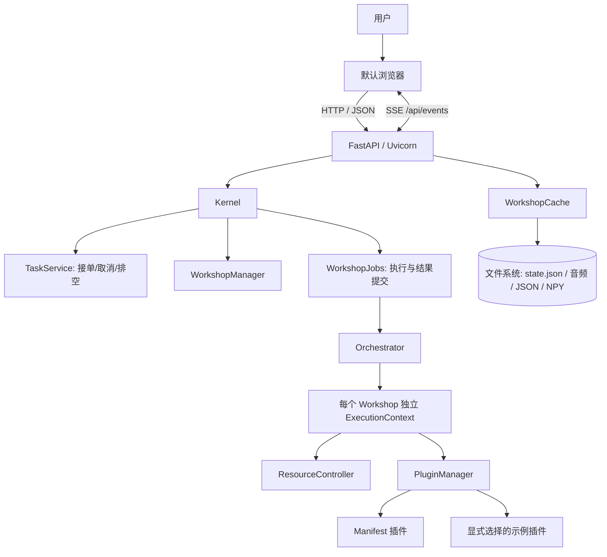

# 当前架构

本文描述仓库当前实现，以可执行代码和自动化检查结果为准。早期 Tauri/Vite、React、WebSocket、SQLite 等设想不属于当前运行架构。

## 系统结构

桌面启动器负责启动本地服务并打开浏览器 UI。UI 是 `src/ui/static/` 中的 HTML、CSS 和 JavaScript，由 FastAPI 托管；请求走 HTTP，长任务状态通过 Server-Sent Events（SSE）推送。

## 运行时职责

- `Kernel` 管理车间生命周期、任务入口和关闭流程；`TaskService` 保留进程内任务句柄、去重并实现同车间排他、取消和安全排空。
- `WorkshopJobs` 通过组合持有 Kernel，负责输入装载、分离/分析监督和产物提交；Kernel 的公开任务方法委托给该服务。`core/event_bus.py` 是唯一事件总线实现。
- `Orchestrator` 管理插件执行。每个车间有独立的 `ExecutionContext`，其中包含自己的 `ResourceController`、`PluginManager` 和 `AnalysisEngine`；进程级 GPU 信号量限制 GPU 插件并发。
- `PluginManager` 从 manifest 发现插件，并在需要时导入和实例化。manifest 可发现只表示插件有描述信息，不保证其依赖、模型权重或设备已经可用。
- UI 当前分离和逐轨分析主路径由 Kernel/Orchestrator 直接调用插件。`AnalysisEngine.run()` 保留了更完整的旧流水线实现，但尚未接入 UI 任务主路径；不得将其描述为当前默认工作流。
- `ResourceController` 管理运行时缓冲、元数据、模型缓存和 VRAM 预算信息。音频缓冲统一为 float32、`(channels, samples)` 且绑定各自采样率。持久化数据由车间缓存写入文件系统，不使用 SQLite。

## 插件与默认行为

分离 API 默认使用 `separation_bs_roformer`。旧 UI 名称 `BS-RoFormer`、`BS-RoFormer-SW` 和 `BS-Roformer-SW` 也映射到这个真实插件。真实插件导入、依赖检查或模型执行失败时会返回/推送失败原因，不会静默切换到示例实现。

`example_separator` 与 `example_analyzer` 是显式可选的开发示例插件。它们生成模拟数据，不代表真实模型推理。和弦分析由 UI 选择 manifest 插件，当前注册表包含 BTC-SL 与 ISMIR2019；已删除的 `chord_chordnet_2e1d` 不再是可用插件。

插件及其权重的发布状态、可选依赖和本机验证状态可能不同。发布说明应分别记录适配器存在、模型资产存在、环境依赖满足和真实推理已验证，不应仅凭 manifest 宣称全部可用。

## 数据与持久化

车间状态写入 `state.json`，音频与分析产物写入车间缓存目录。常见内容包括原始音频、分离音轨、分析 JSON 和可视化数据；内存缓冲只服务于当前进程中的插件运行。SQLite 并未用于当前业务持久化。

任务成功的边界是产物和 `state.json` 均提交完成，再发布 SSE `done`。关闭/删除操作若仍有任务返回 202 与操作 ID，等待排空后完成。进程重启不恢复 Python 执行句柄，遗留的运行中业务状态标记为 `interrupted`。

`state.json` 当前版本为 `SchemaVersion: 1`。无版本的 Workshop 文档视为 v0；启动时先校验、备份为同目录 `state.pre-v1.json.bak`，再原子提交 v1。未来版本、非法版本、损坏内容、备份冲突或写盘失败会使该车间被跳过并报告原因，不改写原状态。已有备份不覆盖；若与待迁移原文件不同，需要人工确认。迁移机制不负责把更早的 Workspace 文件格式转换为 Workshop。详见 [状态版本与实现状态](implementation_status.md)。

## 当前代码入口

| 部分 | 入口 |
|---|---|
| HTTP API 与 SSE | `src/ui/server.py`、`src/ui/api/` |
| 浏览器 UI | `app.js` 装配导航，`app_state.js` 共享状态，`*_controller.js` 管理分离、分析、播放 |
| 车间与 Kernel | `kernel.py`、`workshop_jobs.py`、`workshop_manager.py`、`music_workshop.py` |
| 插件执行与隔离 | `src/kernel/core/kernel_orchestrator.py`、`src/kernel/core/plugin_manager.py` |
| 文件缓存与状态 | `cache_system.py`、`workshop_state.py`、`state_migrations.py`（均在 `src/kernel/core/`） |
| 工作流 HTTP | `analysis.py` 聚合任务路由；`uploads.py` 输入；`media.py` 可视化/音频/MIDI（均在 `src/ui/api/`） |

`workshop.py` 仅重导出兼容 API；旧 Workspace 实现在 `src/kernel/legacy/`，`core/workspace.py` 为兼容入口，主应用不调用。`_s` 模块只提供正式类的别名，不再创建另一套子类。旧分离器和未使用的 Mixer/Timeline 前端实现已移除，历史内容可从 Git 查阅。

可视化无可读音频时返回空波形，无分析结果时返回空节拍/和弦，不生成随机数据。MIDI 正式入口是和弦区间导出；旧音频到 MIDI 的占位接口明确抛错且不创建文件。

## 已知边界

- `AnalysisEngine.run()` 的整体流水线尚未由 UI 任务入口调用。
- 真实插件能否推理取决于已安装依赖、模型资产和本机硬件；UI/API 会把插件执行失败作为明确失败报告。
- `ci.yml` 运行 Ruff correctness 子集、非慢速/非联网 Python 测试和 JavaScript 测试；不包含打包构建或 mypy。仓库另有独立 `codeql.yml` 安全分析工作流，本地 pytest 通过不代表远端 CodeQL 已通过。
- React/Vue、Tauri、WebSocket 和 SQLite 属于历史设计或潜在方案，不是当前实现。
