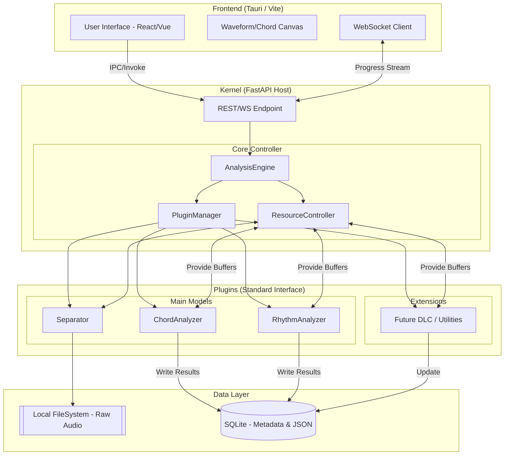

以下是对 **TABsucks** 软件架构设计的详细说明：

---

### 一、 整体设计哲学：微内核与逻辑分层
本项目采用了 **“本地 C/S 架构”**。前端负责极高响应要求的可视化渲染，后端（Kernel）负责计算密集型的 AI 推理。通过 **AnalysisEngine (指挥家)** 和 **ResourceController (后台调度)** 的拆分，实现了业务流与资源流的完美解耦。

---

### 二、 核心模块功能拆解

#### 1. 前端表现层 (Tauri / Vite) —— “舞台与演出”
* **UI (React/Vue)**：用户交互中心，负责任务发起、参数设置（如选择分离精度、调节 BPM）。
* **Canvas (Waveform/Chord)**：**核心渲染引擎**。为了实现 DAW 级别的平滑滚动，不使用传统的 DOM 渲染，而是利用 Canvas/WebGL 绘制多轨波形和和弦网格。
* **WS_Client**：实时同步状态。AI 推理通常耗时，通过 WebSocket 接收后端的进度流（Progress Stream），实现 UI 进度条的丝滑更新。

#### 2. 内核控制层 (Kernel / FastAPI) —— “指挥中心”
这是系统的“大脑”所在地，由三个核心组件构成：
* **AnalysisEngine (AE) [编排者]**：
    * **职责**：负责**业务逻辑的工作流**。它知道一首歌进入后，应该“先分离、后识别”，并根据用户的配置决定是否调用 DLC 插件。
    * **律动感**：它是整首歌的乐谱，决定了每一个插件什么时候进入，什么时候结束。
* **ResourceController (RC) [调控者]**：
    * **职责**：负责**物理资源与内存缓冲**。它持有显存锁（VRAM Lock），确保重型模型不会挤爆显存；同时管理 **Shared Memory (Stems Buffer)**，让分离出的音频流在内存中传递，避免频繁读写硬盘。
* **PluginManager (PM) [工具箱]**：
    * **职责**：管理插件的生命周期。它不关心插件怎么算，只负责把 AE 需要的插件（如 Separator）从仓库里拿出来，并提供标准的调用接口。

#### 3. 插件层 (Plugins) —— “乐手与效果器”
* **Main Models (核心模型)**：
    * **Separator**：重型任务，将原始音频拆解为 Stems（人声、鼓、贝斯、其他）。
    * **ChordAnalyzer / RhythmAnalyzer**：在分离出的特定音轨上进行乐理建模。
* **Extensions (DLC)**：为未来留出的无限可能。比如“MIDI 导出”、“歌词对齐”或“风格转换”工具，通过标准接口实现“即插即用”。

#### 4. 数据层 (Data Layer) —— “乐谱库与仓库”
* **Local FS**：存放原始音频和分离出的高质量 `.wav` 音轨块。
* **SQLite DB**：存储项目的**结构化元数据**。包含识别出的和弦序列、节拍时间戳、项目设置等。这是本地化架构的核心，确保用户下次打开软件时能“秒开”。

---

### 三、 核心工作流 (The "Groove" Flow)

1.  **启动**：用户在 UI 导入音频，API 将路径传给 **AE**。
2.  **资源申请**：**AE** 告诉 **RC**：“我要开始分离了”。**RC** 锁定显存，加载 **Separator**。
3.  **分离与缓存**：**Separator** 处理完后，将结果写入文件系统（FS），同时将引用存入 **RC** 的 Buffer。
4.  **流水线推进**：**AE** 接着通过 **PM** 启动 **Chord** 和 **Rhythm** 插件。**RC** 释放分离器的显存，加载乐理模型，并从内存 Buffer 中提供音频流。
5.  **落库与渲染**：识别出的和弦和节奏信息写入 **DB**，前端通过 API 获取这些 JSON 数据，驱动 **Canvas** 绘制出精美的吉他谱和波形图。

---

### 四、 架构优势总结

1.  **极高的稳定性 (Resource Guard)**：通过 RC 的 VRAM Lock 机制，即使在显存较小的电脑上运行，也能通过“串行加载”保证系统不崩溃。
2.  **DAW 级的交互性能**：Canvas 渲染 + 本地 Buffer 共享，保证了在缩放、拖动音轨时没有延迟感。
3.  **极强的扩展性**：如果要增加一个“指弹识别”功能，只需要写一个新的插件并让 AE 调用即可，不需要重构核心代码。